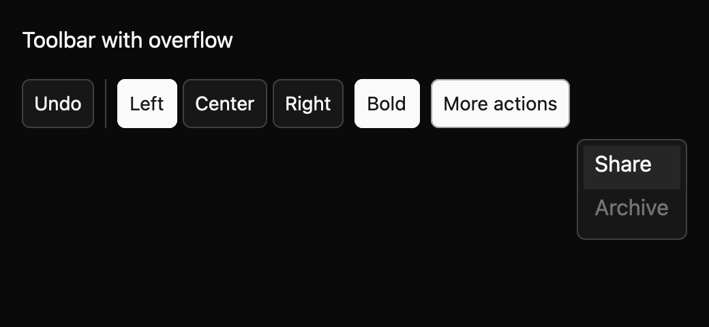

# Toolbar

*Dark theme, 2× baseline capture: `overflow` state.*

A toolbar collects actions that are used often together. It provides one Tab stop, then arrow-key
navigation between actions. Use a horizontal orientation with Left and Right arrows or a vertical
orientation with Up and Down. Home and End move to the first and last enabled action.

`Toolbar` is stateful because it manages its active action, toggle requests, and overflow menu. It
supports push buttons, toggle buttons, toggle groups, and separators. Disabled actions cannot be
activated and are skipped during arrow navigation.

Inside a toggle group, arrow keys mark a choice and Enter or Space requests that value.

## Overflow

Set an explicit `visible_capacity` to move overflow-eligible actions into the menu. Items marked
`NeverOverflow` stay in the toolbar. Groups move as one unit if all choices cannot fit in the
remaining capacity. The menu lists disabled moved actions and skips them during keyboard
navigation. Automatic fit based on measured pixels is not available in this draft because GPUI
does not yet provide the component a stable child-measurement callback.

The registry docs define event behavior, controlled and uncontrolled values, and the current
accessibility contract. The screenshot matrix covers four states, three themes, and two scales.
Native accessibility snapshots remain pending; the component still needs maintainer review before
its public API and accessibility mapping are stable.
