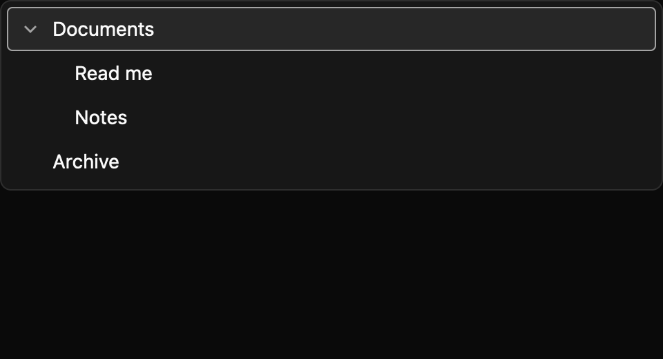

# Tree

> **Draft everyday component.** Its public API, accessibility contract, and visual baselines still need maintainer review. It is not marked `source_ready` for `cargo mkit add`.

A tree lets someone browse nested items without opening a new page for every level. Branches can load children when first expanded.

## When to use it

- Browse project folders.
- Navigate an outline of document sections.
- Show lazily loaded organization units.

## Preview

This is a checked-in dark-theme, 2× screenshot baseline of one state. The component spec lists the other captured states, themes, and scales.

## API and state

`Tree::new` applies expansion locally; `controlled` receives expanded IDs and emits `ExpansionChanged` requests while the owner applies `set_expanded`. Both modes emit `ActiveChanged` when the active row changes. Expanding a lazy node emits one `LoadChildrenRequested` while its children remain absent; `set_children` replaces its children and clears loading. Controlled mode does not display the loading row until the owner applies the expansion.

## Keyboard and pointer behavior

| Key | Behavior |
| --- | --- |
| Up / Down | Move to the previous or next visible row without wrapping. |
| Right | Expand a closed branch or enter its first child. |
| Left | Collapse an open branch or move to its parent. |
| Home / End | Move to the first or last visible row. |

`MkitTree` binds Down/Up to adjacent visible rows, Right to expand a collapsed branch or move into the first child of an expanded branch, Left to collapse an expanded branch or move to its parent, and Home/End to first/last visible row. These actions are rebindable. Navigation does not wrap. Repeated Right while a controlled expansion request awaits the owner does not issue a duplicate lazy-load request.

Clicking a visible row outside its disclosure target makes that node active; the tree root remains the keyboard focus target. Expandable rows provide a separate disclosure hit target, spanning the row's leading 8px padding and its 16px chevron, 24px in all, before the label. Clicking it requests expansion or collapse without activating the row. Controlled expansion changes remain owner-applied: clicking disclosure emits `ExpansionChanged`, but expanded state and lazy loading presentation change only after `set_expanded`. A lazy expansion request emits `LoadChildrenRequested` once while that node remains expanded with children absent; repeated clicks while the request is pending do not duplicate the child-load event. Keyboard Right/Left retain their existing active-row expansion and navigation behavior.

## Accessibility

The root has tree role and accessible label. Visible rows have treeitem role, the node label as accessible name, and level; expandable rows expose expanded state. The active row requests active-descendant semantics and uses an accent fill. Loading is rendered as a treeitem named `Loading…` pending an active-platform announcement design.

## Theme

Theme background, surface, text, muted text, border, accent, accent text, focus; spacing, controls, radii, borders, typography tokens.

The tree is a card with `radii.large` corners, a hairline border, and 4px padding. Rows are 32px (`controls.small`) with `radii.small` corners, like the sidebar items, and each level indents 16px. Branches show vector chevrons and a loading branch shows a vector loader in muted text. The active row takes an accent fill, which the shadcn themes mix from `text` and `background`; while the tree has keyboard focus it also shows a `focus` outline inside the row. Hover uses the accent fill, or a border in high contrast, where the active row keeps the solid accent fill. The spec records the exact token mapping.

## Verification and limits

Two generated keyboard cases (ArrowDown, ArrowRight) pass through a real GPUI adapter, and six registry tests pass, including separate pointer disclosure and controlled lazy-load cases; package Clippy passes with warnings denied. The screenshot matrix passes 18/18 collapsed/expanded/loading comparisons across three themes and two scales.

This API navigates and expands nodes; it does not model selected nodes. Loading announcements still need platform review, and the generated accessibility cases are pending because the headless test platform does not activate the accessibility tree. Disclosure size and behavior plus maintainer API, spec, and visual review are outstanding.

For the exact state and event contract, see the checked-in `registry/tree/spec.md`. The [everyday components overview](../everyday-components.md) tracks current test evidence.
