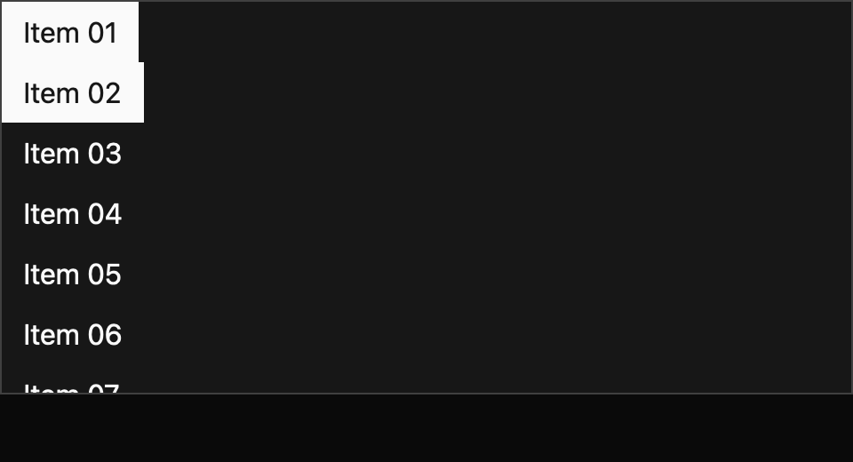

# Virtual list

> **Draft E7 component.** Its public API, accessibility contract, and visual baselines still need maintainer review. It is not marked `source_ready` for `cargo mkit add`.

A virtual list displays a large list inside a bounded scrolling area. GPUI only builds rows around the visible part of the list.

## When to use it

- Browse thousands of search results.
- Select messages in a long inbox.
- Move through a large file list with the keyboard.

## Preview

This is a checked-in dark-theme, 2× screenshot baseline of one state. The component spec lists the other captured states, themes, and scales.

## API and state

`VirtualList::new` owns selection; `controlled` accepts selected IDs and emits selection requests until `set_selection` applies owner state. `single_selection` switches from the default multiple selection. `row_height` defaults to 32 px and clamps to at least 1 px. `viewport_height` defaults to 320 px and clamps to at least 1 px. GPUI `uniform_list` owns live scroll position and derives visible rows; `set_items` replaces items, and `visible_range` remains a pure clamped range helper. `set_visible_window` is retained as a deprecated compatibility method; it requests the start row at the top and ignores count while GPUI derives the rendered range. Navigation emits `ActiveChanged` and scrolls the active row into view; Space toggles the active ID and emits `SelectionChanged`. Clicking a row activates it and uses the same selection toggle request; in controlled mode the owner must apply that request through `set_selection`.

## Keyboard and pointer behavior

| Key | Behavior |
| --- | --- |
| Up / Down | Move the active row without wrapping and scroll it into view. |
| Home / End | Move to the first or last item. |
| Space | Toggle selection of the active item. |

`MkitVirtualList` binds Down/Up to adjacent items, Home/End to first/last item, and Space to toggle selection of the active item. The actions are rebindable and navigation does not wrap. Navigation scrolls the active row into view, including when it lies outside the currently rendered range.

The list viewport responds to GPUI wheel scrolling. Clicking a rendered row activates it and toggles its selection. In single-selection mode, selecting a row clears the previous selection; clicking the selected row clears it.

## Accessibility

The focusable root has listbox role and accessible label. Rendered rows have listbox-option role, the item's label as their accessible name, selected state, set position, and set size; the active row requests active-descendant semantics. Off-window rows are absent from the accessibility tree. The pinned GPUI bridge does not expose a multi-selectable setter here, so the default multi-selection mode needs active-platform semantics review.

## Theme

`surface`, `accent`, `accent_text`, `text`, `border`, `borders.hairline`, and `spacing.medium` come from GPUI `Theme`; row height is an API value.

## Verification and limits

Two generated keyboard cases (ArrowDown `ActiveChanged`, Space `SelectionChanged`) pass through a real GPUI adapter, and five package tests pass, including uncontrolled and controlled row-click selection and 10,000-row keyboard-to-end and wheel-scroll checks. The screenshot matrix passes 18/18 idle/selected/empty comparisons across three themes and two scales.

Offscreen rows are absent from the accessibility tree. The default multiple-selection mode still needs active-platform semantics review, and the generated accessibility cases are pending because the headless test platform does not activate the accessibility tree. The full E5 conformance matrix and maintainer API, spec, and visual review are outstanding.

For the exact state and event contract, see the checked-in `registry/virtual-list/spec.md`. The [E7 overview](../everyday-components.md) tracks current test evidence.
