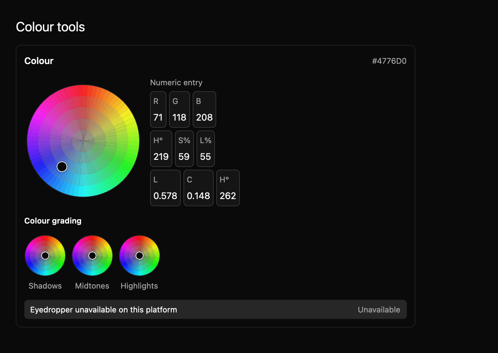
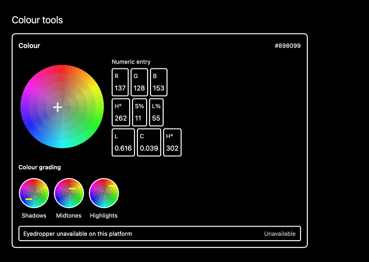

# Colour tools

Colour tools let someone choose a colour and adjust separate tonal ranges. This draft combines a hue and saturation wheel, numeric sRGB/HSL/OKLCH fields, and grading wheels for shadows, midtones, and highlights.



The [light theme preview](../../images/e8-colour-tools-light-2x.png) uses the same app data and GPUI theme tokens. Both themes have 1× and 2× harness captures.



## Build a picker

The compiling example creates a colour from sRGB bytes and mounts the editor as an entity:

```rust
{{#include ../../../../examples/e8_components/src/lib.rs:colour_tools_preview}}
```

The large wheel changes hue by angle and saturation by distance from the centre. Hue zero is at the top and increases clockwise. The marker sits over the colour that pointer input would choose. Numeric fields accept values in sRGB, HSL, and OKLCH; changing one converts the working colour and emits `ColourChanged`. The three smaller wheels emit `GradingChanged` for separate shadows, midtones, and highlights offsets. In controlled mode, the app accepts a proposal by calling `set_colour` or `set_grading`; the displayed state stays with the owner until that echo, and an equal echo emits no new event. In uncontrolled mode, the component updates before emitting.

OKLCH values outside sRGB currently convert by clipping each encoded RGB channel independently. The stored colour is that clipped sRGB result; the displayed OKLCH values are recalculated from it. This does not preserve requested hue and lightness through chroma reduction, so maintainers should review this gamut policy before stabilizing the API.

| Input | Behavior |
| --- | --- |
| Drag or click a wheel | Choose hue and saturation. |
| Arrow keys on a focused wheel | Adjust hue or saturation. |
| Shift + Up / Down | Adjust lightness. |
| Numeric field | Enter a component value and update the working colour. |

The colour wheel paints colour data; its panel, field borders, text, focus treatment, and disabled styling come from the GPUI Global theme. The eyedropper is explicitly unavailable in this draft because no supported platform sampling backend is wired. A host should offer another sampling route if that workflow matters. The source contract is recorded in `registry/colour-tools/spec.md`.

Nine focused tests pass, covering colour conversion, wheel orientation, numeric and grading interactions, controlled proposals with owner echo/no-op behavior, and out-of-sRGB channel clipping; package check and Clippy pass with warnings denied. The generated conformance manifest declares six keyboard, three accessibility, and 18 screenshot cases. The dedicated screenshot matrix covers selected, eyedropper-unavailable, and grading states across light, dark, and high contrast at 1× and 2×. The grading fixture applies distinct offsets to all three wheels before capture. Native accessibility, maintainer approval of the gamut policy, keyboard traversal across all nine numeric fields, and public API review remain open.
