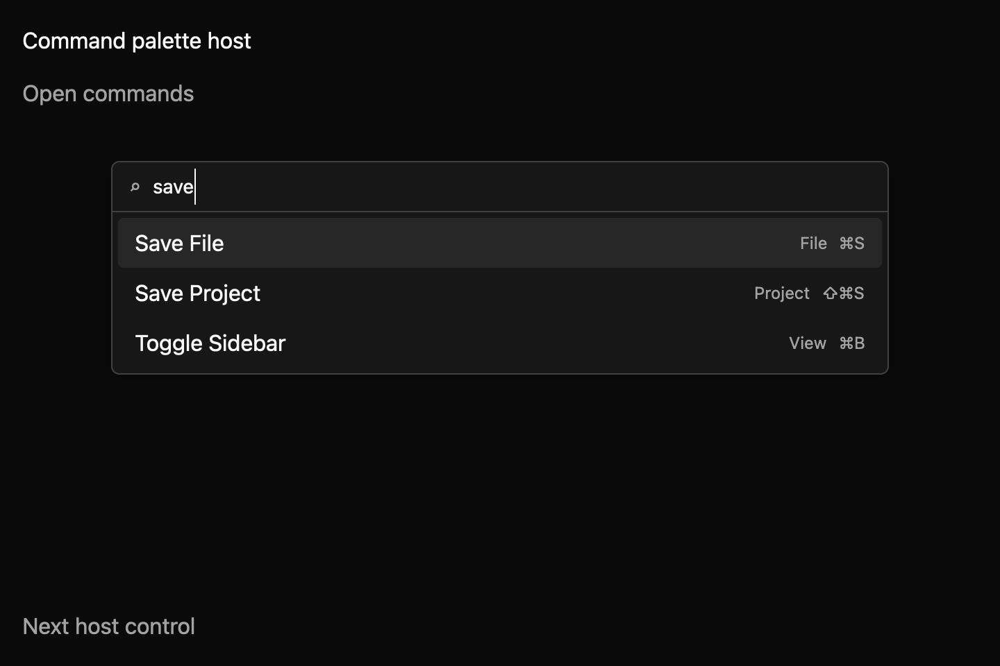

# Command palette

A command palette gives people one place to search for an app action and run it. The app supplies the actions, their labels, optional search words, and any keybinding hints. The palette returns the selected action ID so the app can carry it out. This is a draft pro-app component.



The [filtered light theme preview](../../images/e8-command-palette-filtered-light-2x.png) comes from the same macOS screenshot harness. The matrix covers closed, open empty, filtered, no-match, and disabled states in light, dark, and high-contrast themes at 1× and 2×. Filtered and no-match cases type a real query into the focused search field.

This compiling example supplies action IDs, labels, groups, and displayed keybindings:

```rust
{{#include ../../../../examples/e8_components/src/lib.rs:command_palette_preview}}
```

## Use it for

- Finding an editor action without browsing menus.
- Discovering the shortcut for an action while searching.
- Offering the same actions in a keyboard-first surface.

Keybinding text goes through the shared [KeyHint](../e7/key-hint.md) formatter, so the palette, menus, and the shortcut editor show the same platform key names. `⌘⇧S` and `cmd-shift-s` both appear as `⇧⌘S` on macOS. Text the formatter cannot read is shown as written. Each result's accessible name uses the same formatted label.

## Behavior

The search matches label, group, and keywords without case sensitivity. It accepts a sequence of characters even when they are not adjacent. Disabled actions are hidden. The active result stays selected when the app replaces the action list and its ID remains in the results.

| Input | Behavior |
| --- | --- |
| Text input | Filter the supplied actions. |
| Up / Down | Move through matching results, wrapping at either end. |
| Enter | Emit the active action ID and close. |
| Escape | Close without activating. |
| Tab / Shift+Tab | Keep focus in the search field while the palette is open. |

The palette requests dialog semantics; its search input and results have accessible names and roles. The host controls action execution and keeps the dialog mounted while open. Opening remembers the prior focus target, and closing restores it where supported. The source workspace's `registry/command-palette/spec.md` describes controlled and uncontrolled visibility and the event contract.

The focused component tests cover fuzzy matching, empty queries, disabled-action filtering, typed search, arrow selection, Tab and Shift+Tab focus containment, activation, Escape, and opener focus restoration. The pro-app harness compares 30 manifest-driven screenshots (five states × three themes × two scales); candidates were inspected before their baselines were written. Capture requires macOS Metal. Native accessibility snapshots and keyboard review remain pending, as does maintainer review of API naming, keyboard/focus and dialog semantics, and visual baselines. No accessibility adapter result is claimed.
