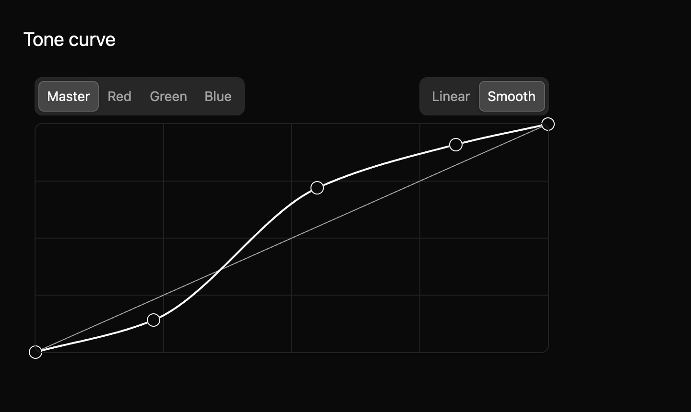
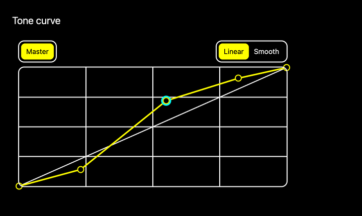

# Curve editor

A curve editor lets someone reshape an input-to-output mapping by moving points. It can serve a photo tone curve, an audio response curve, or another app-defined mapping. The app supplies named channels and interprets the normalized coordinates. This is a draft pro-app component.



The [light theme preview](../../images/e8-curve-editor-light-2x.png) comes from the same example and screenshot harness. The thin diagonal shows the unchanged identity mapping; the thicker line shows the edited curve.



Points are round handles like the Slider thumb; the selected point carries a focus ring, and keyboard focus rings the whole graph card. Channel and interpolation choices use the Segmented control look. The selected point preview is part of a 36-case harness matrix covering linear, smooth, selected, multiple-channel, disabled, and keyboard-focused states in light, dark, and high contrast themes at 1× and 2×.

## Build a curve

This compiling example supplies a master curve and three color channels. Each channel starts and ends at fixed anchors. The app can choose straight segments or smooth interpolation.

```rust
{{#include ../../../../examples/e8_components/src/lib.rs:curve_editor_preview}}
```

Interior points stay in x order and inside the graph. Smooth interpolation is monotone between points, so it does not overshoot their y values. In uncontrolled mode the component updates its points and emits `CurveChanged`. In controlled mode it emits the proposed points and waits for the owner to apply them through `set_channel_points`.

## Input

| Input | Behavior |
| --- | --- |
| Click in the graph | Add and select a point. |
| Drag a point | Move it within its neighbors and the graph. |
| Right-click a point | Remove an interior point. |
| Arrow keys | Nudge the selected point by 0.01. |
| Shift + arrow | Nudge it by 0.001. |
| Delete | Remove the selected interior point. |
| Tab / Shift + Tab | Cycle channels. |
| `L` / `S` | Select linear or smooth interpolation. |

The root requests a named group role; channel and interpolation controls request button semantics, and point labels include coordinates. Focused GPUI tests cover add, move, delete, keyboard nudge, channel and interpolation events, and controlled-mode proposals. Native screen-reader output and public API review remain pending. The exact draft contract is recorded in `registry/curve-editor/spec.md` in the source workspace.
