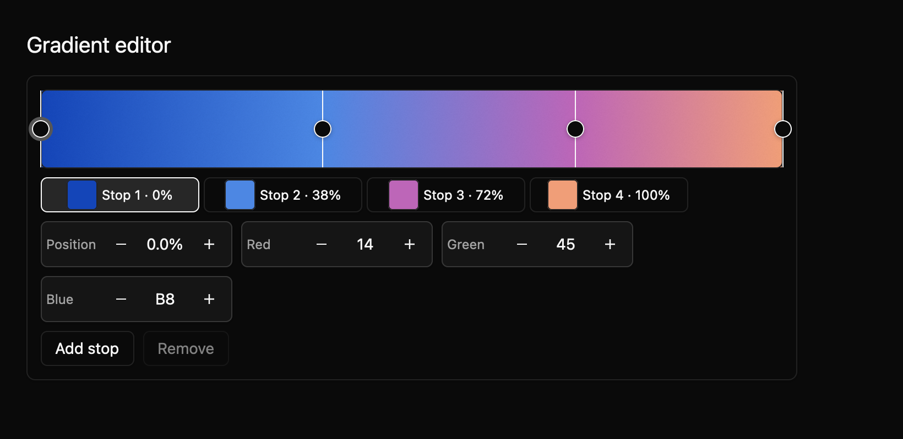
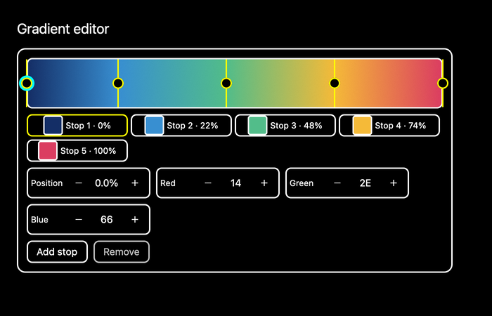

# Gradient editor

A gradient editor lets someone build a colour transition by adding, moving, recolouring, and removing stops. The live strip shows the result as they work.



The [light theme preview](../../images/e8-gradient-editor-light-2x.png) uses the same compiling example. The macOS screenshot harness captures both themes at 1× and 2×.



## Build a gradient

This example starts with four stops. Positions run from `0.0` at the start to `1.0` at the end; RGB channels also use values from `0.0` to `1.0`.

```rust
{{#include ../../../../examples/e8_components/src/lib.rs:gradient_editor_preview}}
```

The two endpoint stops stay at the ends. New stops sample the current gradient in its widest gap. Interior stops can move without crossing their neighbours. The editor keeps no more than 16 stops. `GradientChanged` carries a proposed full gradient; uncontrolled mode applies it locally, while controlled mode waits for the app to call `set_gradient`.

## Input

Click a stop to select it, or use the rebindable keyboard actions to move and edit the selected stop. The preview supports pointer dragging of an interior stop. The buttons add or remove stops and adjust position and RGB channels. The source contract is in `registry/gradient-editor/spec.md`.

The card, round stop handles, Text field styled position and RGB fields, outline buttons, and focus rings use GPUI Global theme tokens; the strip itself shows the gradient data. The selected stop's handle carries a focus ring, while keyboard focus rings the strip. Six focused tests cover controlled Tab navigation, silent owner echo and equal-value proposals, disabled keyboard and pointer selection, plus basic editing. A dedicated screenshot matrix covers default, selected stop, many stops, controlled, disabled, and keyboard-focused states in light, dark, and high contrast at 1× and 2× (36 baselines). The source contract is in `registry/gradient-editor/spec.md`. Native accessibility snapshots and maintainer review of the public API, keyboard contract, and visual baseline remain open.
