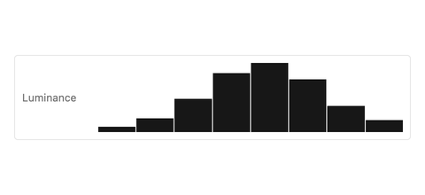
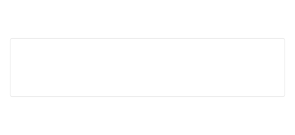

# Histogram

A histogram shows how image values are distributed. The application calculates the bins and provides a short text summary. The component renders the plot without taking keyboard focus. This is a draft seeded from Laika's existing histogram footprint.

## Use it for

- Check the tone spread of a photo while adjusting exposure.
- Compare red, green, and blue channel distributions in a color tool.
- Show whether shadows or highlights are clipped in an analysis panel.

## Data and behavior

`Histogram::new(label, summary)` creates an empty plot that keeps the default 78 logical pixel chart height. Add one luminance series with `.luminance(values)` or three series with `.rgb(red, green, blue)`. Values are finite and clamped to 0–1; each series is scaled to its own peak to make its shape visible. `.clipping(shadows, highlights)` adds status indicators. The builder is stateless, so the app constructs a new one when its data changes.

| Input | Behavior |
| --- | --- |
| Keyboard | No component keys; the read-only image is not a tab stop. |
| Pointer | No selection or hover inspection in this draft. |

The root requests an image role with the supplied name and summary. Individual bars are decorative. Keep the summary synchronized with the data and include the clipping result in it. Live platform accessibility output has not yet been verified.

The plot uses the current theme's surface, border, accent, and semantic colors. The shared [pro-app preview](./) compares in light and dark. A dedicated harness matrix now covers luminance, RGB, clipping, and empty states in light, dark, and high contrast at 1× and 2×. The exact draft contract is in `registry/histogram/spec.md` in the source workspace.
