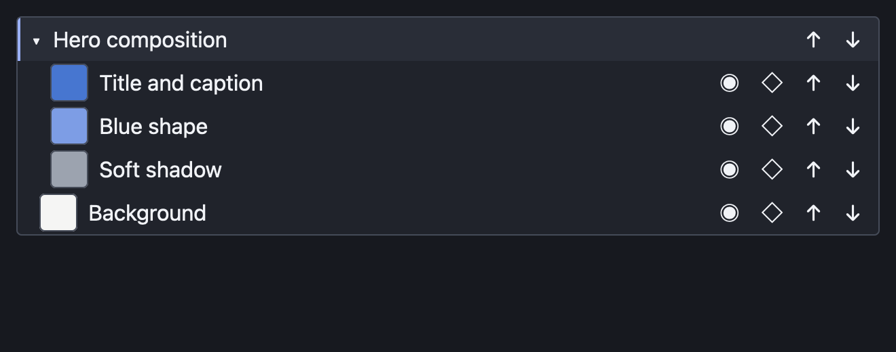
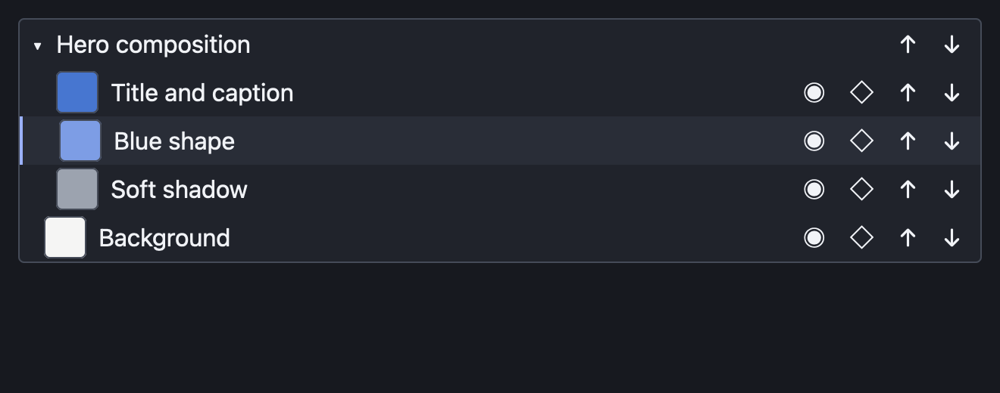
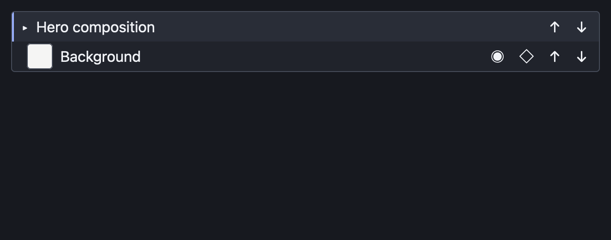
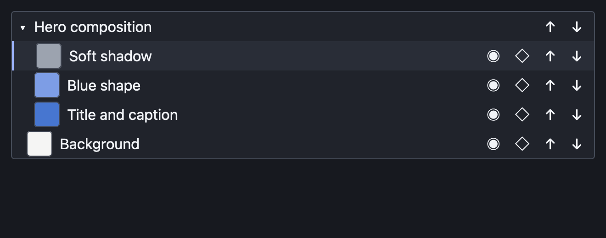
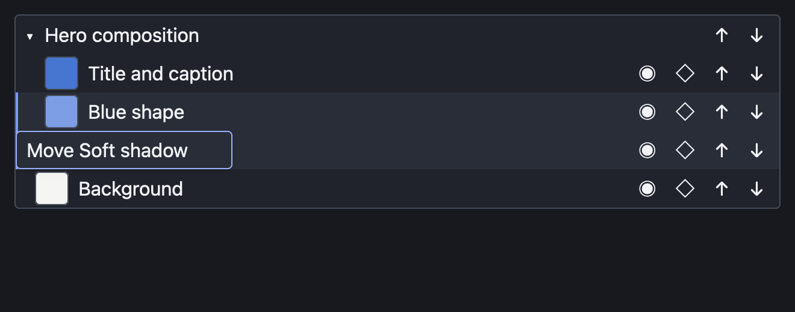

# Layer panel

A layer panel gives an editor a compact outline of its artwork. Groups can contain layers; each layer can show a thumbnail or colour swatch, and people can select, hide, lock, or reorder it.



The [light theme preview](../../images/e8-layer-panel-mixed-tree-light-2x.png) uses the same example and GPUI Global theme tokens. The harness covers each declared state in light, dark, and high-contrast themes at 1× and 2×.

## Build a layer tree

This compiling example creates a group with three layers and a separate background layer. The swatches are example artwork data, not component theme colours.

```rust
{{#include ../../../../examples/e8_components/src/lib.rs:layer_panel_preview}}
```

`LayerNode::group` nests children. `LayerNode::layer` accepts an optional image source through `with_thumbnail` or a solid fallback through `with_swatch`. Stable IDs identify rows in events. In uncontrolled mode, the panel applies changes locally before emitting typed events. In controlled mode, the app applies proposed changes through the setters.

## Input

| Input | Behavior |
| --- | --- |
| Up / Down | Move selection between visible rows. |
| Right / Left | Expand or collapse the selected group. |
| Space | Show or hide the selected layer. |
| `L` | Lock or unlock the selected layer. |
| Alt+Up / Alt+Down | Move the selected row among siblings. |
| Pointer controls | Select, toggle visibility or lock, drag among siblings, or move a row one position. |

The tree, items, and toggle buttons expose AccessKit roles and labels. The component supports same-parent drag reordering. Cross-parent drops and drops into groups are intentionally unsupported; they receive no drop-target treatment and emit no reorder event. The screenshot harness covers mixed, selected, collapsed, reordered, and live-drag states in light, dark, and high contrast at both scales. The actual drag capture dispatches pointer events from one child to another sibling. Seven package tests cover tree flattening, same-parent validation, controlled reorder requests, cross-parent rejection, pointer toggles, and keyboard reorder. Sibling position and set size are not yet surfaced in the accessibility tree. Native accessibility snapshots and maintainer review of the API, events, keyboard, accessibility, and visuals remain open. The source contract is in `registry/layer-panel/spec.md`.

## State previews








