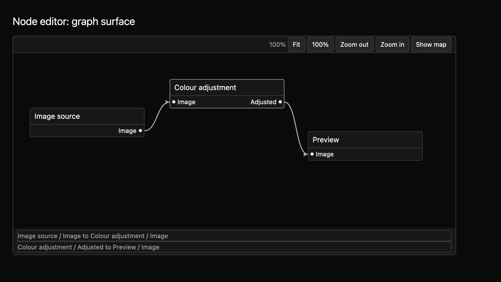

# Node editor: graph surface

The node editor displays an app's graph as connected blocks. A block represents one step in a process. Its labeled input and output ports show where data enters and leaves, while lines show existing connections. The N1–N4 slices cover graph navigation, proposed node movement, typed connection editing, and optional minimap navigation. The app owns graph data throughout.



The [light theme preview](../../images/e8-node-editor-n1-light-2x.png) uses the same compiling example. The manifest-driven matrix adds 13 states across light, dark, and high-contrast themes at 1× and 2× (78 captures), including actual pointer and keyboard interaction previews. See [N3](node-editor-n3.md) and [N4](node-editor-n4.md) for connection and minimap behavior.

## Supply a graph

Give each node, port, and connection a stable ID. Positions are in graph coordinates, so the view can pan and zoom without changing the graph data. The app remains responsible for running the graph and deciding which connections are valid.

```rust
{{#include ../../../../examples/e8_components/src/lib.rs:node_editor_n1_preview}}
```

## Navigate

Arrow Up and Down move between nodes in reading order. Space selects a node, and Enter moves into its ports. Alt plus arrow keys pans; `=` and `-` zoom; `F` fits the graph; `1` returns to actual size. Hosts can rebind these actions through the `MkitNodeEditor` key context.

`NodeEditor` has controlled and uncontrolled modes for view position and selection. A controlled app handles `ViewChanged` and `SelectionChanged` requests, then supplies accepted state. The component exposes named nodes, ports, and connections to accessibility. The N1–N4 contract and typed graph-edit requests are in `registry/node-editor/spec.md`. [N3](node-editor-n3.md) covers connection editing; [N4](node-editor-n4.md) covers optional minimap navigation. The screenshot matrix covers all 13 declared states. Native accessibility snapshots, pointer capture outside the canvas, trackpad behavior, and maintainer review of the public API and interaction contract remain open.
