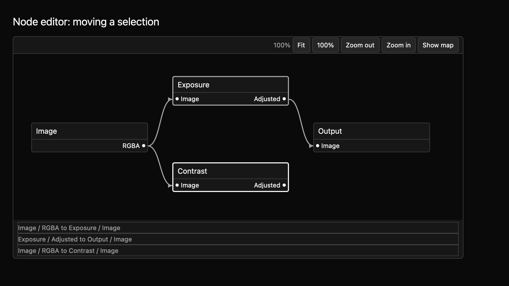

# Node editor: movement and box selection

N2 extends the [navigable graph surface](node-editor-n1.md) with multi-node selection, a selection box, and node movement requests. The app still owns the graph. Dragging shows a temporary preview; a node's saved position changes only when the app supplies an updated graph.



The same preview is available in [light at 2×](../../images/e8-node-editor-n2-light-2x.png).

## Supply and update the graph

This compiling example uses stable node IDs and graph coordinates. It starts with two selected nodes. Drag one of them in the running example to preview a group move.

```rust
{{#include ../../../../examples/e8_components/src/lib.rs:node_editor_n2_preview}}
```

Dragging a selected node moves the selected set in the preview while keeping their spacing. Dragging an unselected node selects it first. On release inside the canvas, a changed drag emits one `NodesMoveRequested` with final positions for stable node IDs. The release position is used even when no final move event arrives. A delivered release outside the canvas cancels the preview without a request. The preview clears immediately. The app accepts the request by passing its updated graph to `set_graph`; if it rejects the request, the original graph stays visible. Escape also cancels a preview. A request with any invalid or non-finite position is rejected as a whole.

View position and selection can each be controlled or uncontrolled. Uncontrolled selection updates before `SelectionChanged`; controlled selection emits a request and waits for `set_selection`. Node movement always remains a proposal, regardless of those modes.

## Select with pointer or keyboard

Click a node to focus and select it. Shift-click adds a node; Command-click on macOS, or the platform equivalent, toggles it. Drag on empty canvas to draw a selection box. Only node cards fully inside the box are selected. Shift adds the box results, and the platform modifier toggles them. Middle-button drag or Space plus left drag pans the canvas.

With the editor focused, Space selects the focused node, Shift+Space adds it, and the platform modifier plus Space toggles it. Shift+Alt+Arrow proposes a one-graph-unit nudge of selected nodes. Shift+B begins keyboard box selection around the focused node; Shift+Arrow moves its active corner one graph unit, Shift+Enter commits, and Escape cancels. The named `MkitNodeEditor` actions can be rebound. The N1 arrow navigation, port navigation, zoom, and fit commands still apply.

The labeled graph group exposes named nodes and ports, selected state, and a description of the live box selection count. The box and selected cards use theme accent, border, and focus tokens, with a visible treatment beyond color alone.

The source contract is in `registry/node-editor/spec.md`. Undo and graph persistence belong to the host. [N3](node-editor-n3.md) adds proposal-only connection editing, and [N4](node-editor-n4.md) adds optional minimap navigation. The 13-state screenshot matrix covers movement and box-preview states across three themes and two scales. Native screen-reader traversal, pointer capture outside the canvas, and maintainer review of the public API and keyboard contract remain open.
