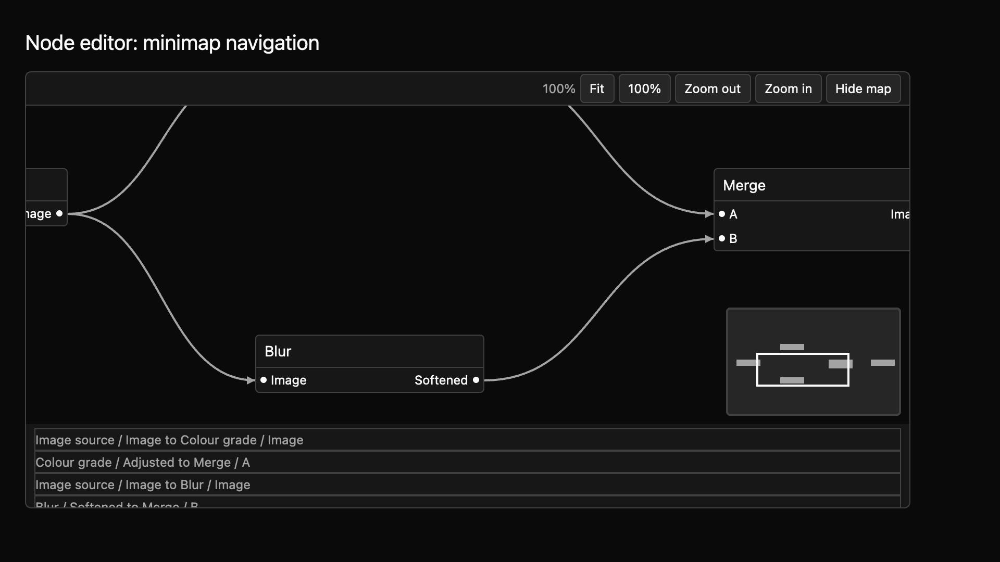

# Node editor: minimap navigation

N4 adds an optional overview for navigating large graphs. The minimap shows finite node bounds and the current viewport rectangle. It is hidden when a `NodeEditor` is created; use the toolbar control, `m`, or `set_minimap_visible` to show or hide it.



The [light theme preview](../../images/e8-node-editor-n4-light-2x.png) shows the same graph. The preview is rendered by the compiling example crate.

```rust
{{#include ../../../../examples/e8_components/src/lib.rs:node_editor_n4_preview}}
```

Click the overview to center the viewport on that graph region. Pan with `Alt+Arrow`; focus any node with the reading-order arrows and press `v` to center it. These routes work without a pointer on the minimap. A view request emits `ViewChanged`; controlled view state waits for the host setter, while uncontrolled view state updates locally before the event.

Minimap visibility is uncontrolled by default, so the toolbar and `m` update it before emitting `MinimapVisibilityChanged`. Build with `with_controlled_minimap` when the host owns that value; then the same controls emit requests and wait for `set_minimap_visible`.

The minimap button names the control and describes the visible world-coordinate range. Tab can move focus through and out of the control normally. The minimap is 168 by 104 logical pixels, with its graph and viewport marks sized from graph bounds while preserving aspect ratio.

The source contract is in `registry/node-editor/spec.md`. The manifest-driven screenshot matrix covers minimap visible and hidden states at 1× and 2× in light, dark, and high-contrast themes. Keyboard and pointer navigation fixtures are included. Native screen-reader and trackpad checks remain, along with maintainer review of the public API, keyboard and accessibility contract, and visual baselines.
