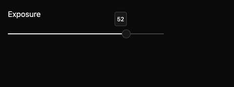

# Precision slider

A precision slider adjusts a number by dragging or using the keyboard. It is designed for settings where people need both quick movement and small corrections, such as exposure, audio balance, or a filter strength. This is an E8.3 draft.


## Try it

The shared E8 example creates a bipolar slider called **Tone balance** and displays it below the histogram. The code is compiled as part of the example crate.

```rust
{{#include ../../../../examples/e8_components/src/lib.rs:e8_preview}}
```

The host chooses bounds, a starting value, a reset value, and a step. A bipolar range fills from zero toward the value instead of filling from one end. A small tooltip shows the value during dragging. In controlled mode, the slider emits a change request and waits for the host to apply it; in uncontrolled mode, it updates itself before emitting.



## Input

| Input | Behavior |
| --- | --- |
| Left / Right | Move by one step. |
| Shift + Left / Right | Move by a fine step. |
| Home / End | Go to the lower or upper bound. |
| `R` | Restore the reset value. |
| Pointer drag | Adjust continuously; hold Shift for fine movement. |
| Double-click | Restore the reset value. |

The root requests the slider accessibility role, a label, numeric value, bounds, and disabled state. The component uses the GPUI Global theme for its track, fill, thumb, tooltip, and focus treatment. [shadcn/ui's slider](https://ui.shadcn.com/docs/components/base/slider) informs the quiet visual treatment; the interaction contract is recorded in `registry/precision-slider/spec.md` in the source workspace.

Focused GPUI tests cover keyboard stepping and reset, pointer drag and fine drag, double-click reset, and controlled requests. A dedicated harness matrix covers minimum, middle, maximum, dragging, and disabled at light, dark, and high contrast in 1× and 2×. Its dragging fixture dispatches a real pointer move and asserts that the value changed before capturing the tooltip. The generated accessibility cases, native screen-reader behavior, and public API review are still pending.
