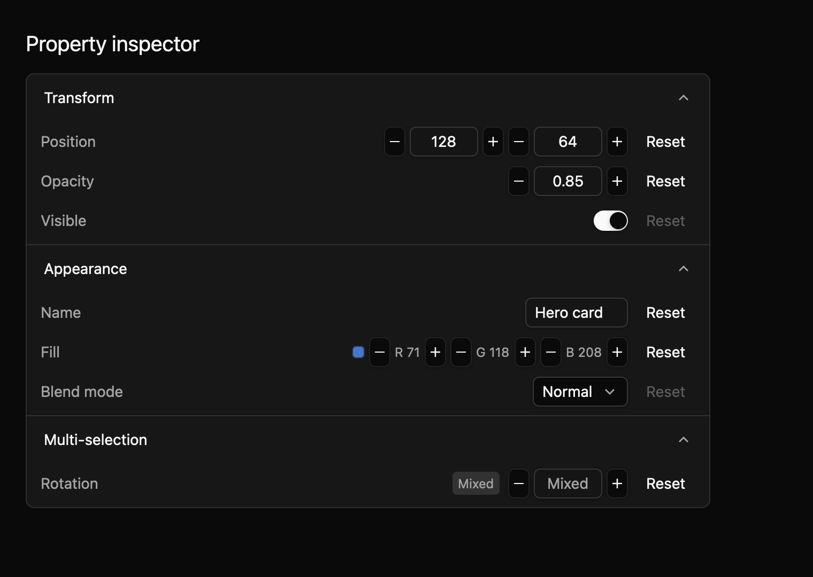
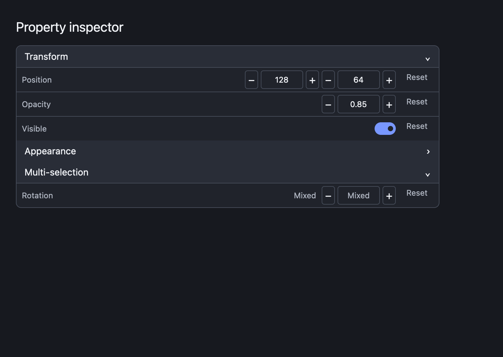
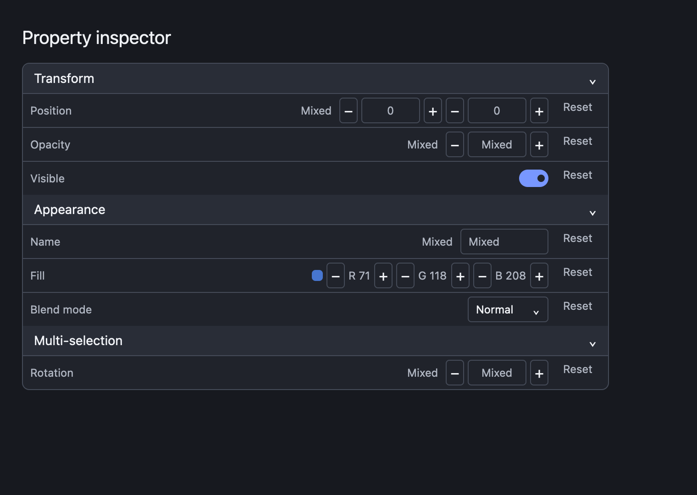
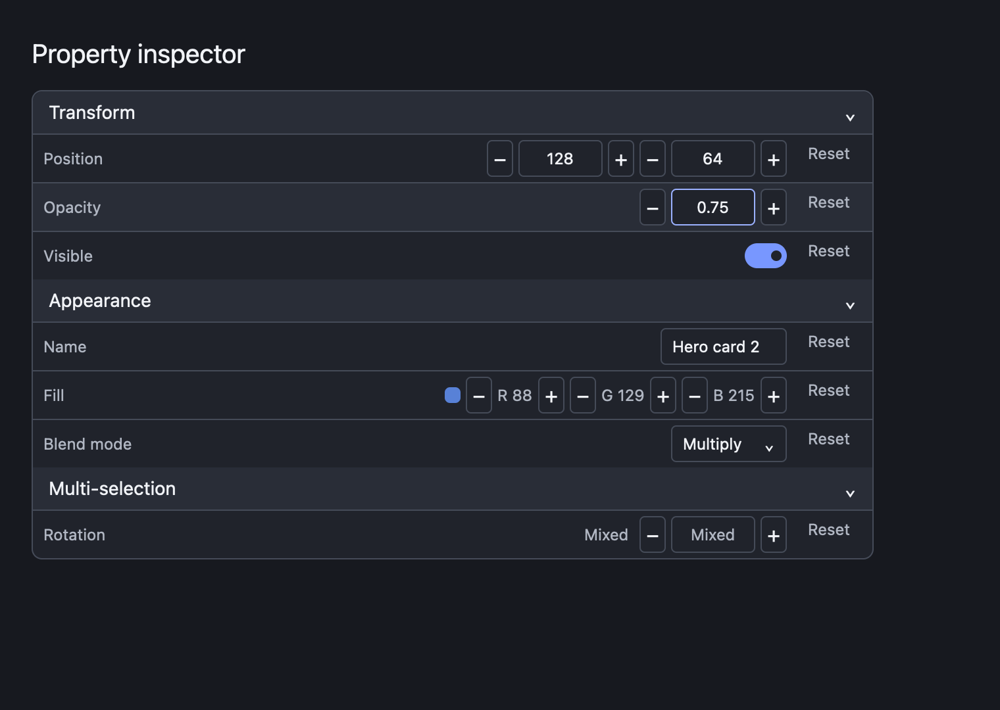
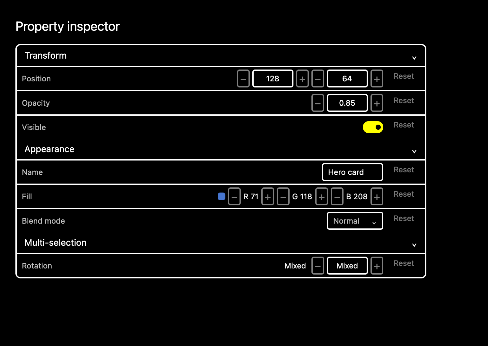

# Property inspector

A property inspector builds an editing panel from an app's property data. It groups related settings and chooses a control for each value type. This draft supports numbers, text, booleans, enums, colours, and two- or three-component vectors.



The screenshot harness captures five states in light, dark, and high-contrast themes at 1× and 2×. Its edited state clicks the opacity increment control before capture.

## Build a panel

This compiling example supplies Transform, Appearance, and Multi-selection groups. The Rotation row has a mixed value because the selected objects disagree.

```rust
{{#include ../../../../examples/e8_components/src/lib.rs:property_inspector_preview}}
```

Each property has an ID, label, editor kind, current value, and default value. Groups can collapse. Each group header is the [disclosure](../e7/disclosure.md) component's `DisclosureTrigger`, and an expanded group's rows sit inside a `DisclosurePanel`, so headers share the disclosure button, expanded state, and rebindable `Toggle` action. The inspector still owns which groups are open. This makes the inspector depend on the registry disclosure crate, a draft exception that awaits maintainer approval. A mixed value becomes concrete when someone edits it. Every row can request a reset to its default. In uncontrolled mode the inspector updates its value before emitting `ValueChanged`; in controlled mode it emits a proposal and waits for the app to call `set_value`.

## Input

| Input | Behavior |
| --- | --- |
| Arrow Up / Down | Move between visible property rows. |
| Space | Toggle the active boolean value. |
| `R` | Reset the active property. |
| Group header | Expand or collapse with pointer, Enter, or Space (the disclosure `Toggle` action). |
| Number/vector controls | Increment or decrement by the declared step. |
| Enum control | Cycle through the declared options. |
| Text control | Enter a compact editing mode; basic typing and Backspace work. |
| Colour controls | Adjust red, green, and blue channels. |

`default_key_bindings()` returns the four inspector bindings followed by the two disclosure bindings. While a header has focus, its disclosure binding for Space takes precedence over the root's boolean toggle.

The panel uses the GPUI Global theme for its compact surfaces, borders, text, and focus treatment. Arrow navigation skips disabled properties and collapsed rows, wraps among enabled visible properties, and returns focus to the inspector root so keyboard actions stay with the active row. Tab still traverses the individual typed controls; disabled controls are removed from tab order. [shadcn/ui's input](https://ui.shadcn.com/docs/components/base/input) is a visual reference for the restrained field styling. The source contract is recorded in `registry/property-inspector/spec.md`.

Thirteen focused tests pass. Six data tests cover mixed-value kind preservation, invalid type fallback, enum cycling, number formatting, hex channel clamping, and the combined key bindings. Seven GPUI tests exercise pointer boolean editing and group collapse, header Enter/Space through the disclosure action, disabled headers, keyboard text editing, colour channel editing, enum/reset behavior, and focus/navigation across disabled and collapsed rows. The screenshot matrix covers expanded, collapsed, mixed, edited, and disabled states in light, dark, and high-contrast themes at both scales. The edited capture dispatches a real pointer click to the opacity increment and shows the resulting value. Native IME, text selection, clipboard handling, platform accessibility snapshots, and maintainer review of the public API, naming, keyboard/accessibility contracts, and visual baselines remain open.








