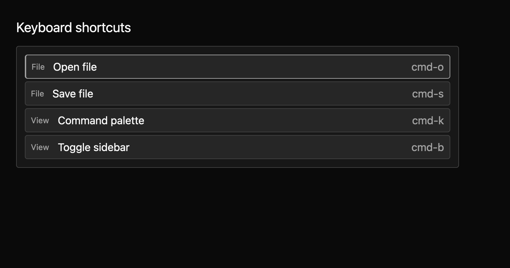
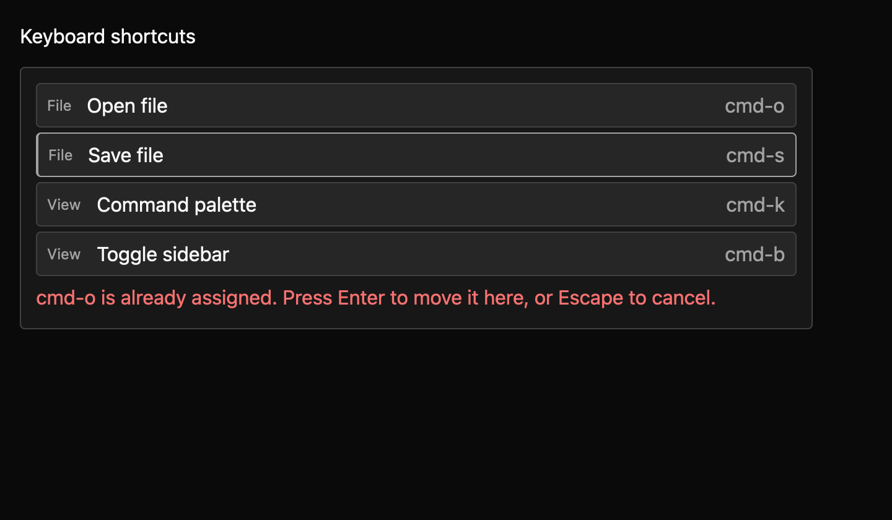

# Shortcut editor

A shortcut editor lists an app's actions and their current keys. People can select an action, capture a replacement key chord, see conflicts, and save a keymap file.



The [light theme preview](../../images/e8-shortcut-editor-light-2x.png) uses the same compiling example. Both themes have 1× and 2× macOS harness captures.



The matrix also includes capture, dirty, saved, and save-error states across all three themes and both scales.

## List shortcuts

This example provides stable action IDs, labels, categories, and current GPUI key chords.

```rust
{{#include ../../../../examples/e8_components/src/lib.rs:shortcut_editor_preview}}
```

Up and Down select a row; Enter begins capture; Escape cancels; Delete clears the selected binding. If a new chord is already assigned, the editor names the conflicting action. Enter can move that chord to the selected action. These keys are app-rebindable actions under `MkitShortcutEditor`.

The host still owns action execution and GPUI key bindings. This compiling adapter maps a loaded keymap's known action IDs to the host's statically typed GPUI actions:

```rust
{{#include ../../../../examples/e8_components/src/lib.rs:shortcut_editor_host_keymap}}
```

In uncontrolled mode, an accepted edit updates the local map and emits `BindingChanged`. In controlled mode it emits `BindingChangeRequested` and waits for the app to apply the proposed map. Calling `save_to_path` writes versioned JSON and emits success or failure; edits alone do not write a file. The app remains responsible for loading the file and installing GPUI keybindings. The source contract is in `registry/shortcut-editor/spec.md`.

Five component tests pass: four data tests cover normalized conflict lookup, stable escaped JSON output, and clearing an assignment, and a GPUI keyboard script captures a conflicting Command chord, resolves it, and verifies the saved keymap file. The E8 harness now compares 36 manifest-driven screenshots (six states × three themes × two scales); capture uses GPUI keystroke dispatch for real chord capture, conflict, and save paths. Candidate images were inspected before baseline updates. The host example demonstrates mapping loaded IDs to typed GPUI key bindings. Platform accessibility snapshots and maintainer review of the keymap format, conflict policy, API, keyboard/accessibility contracts, and visual baselines remain open. Screenshot capture requires macOS Metal. The source contract is in `registry/shortcut-editor/spec.md`.
