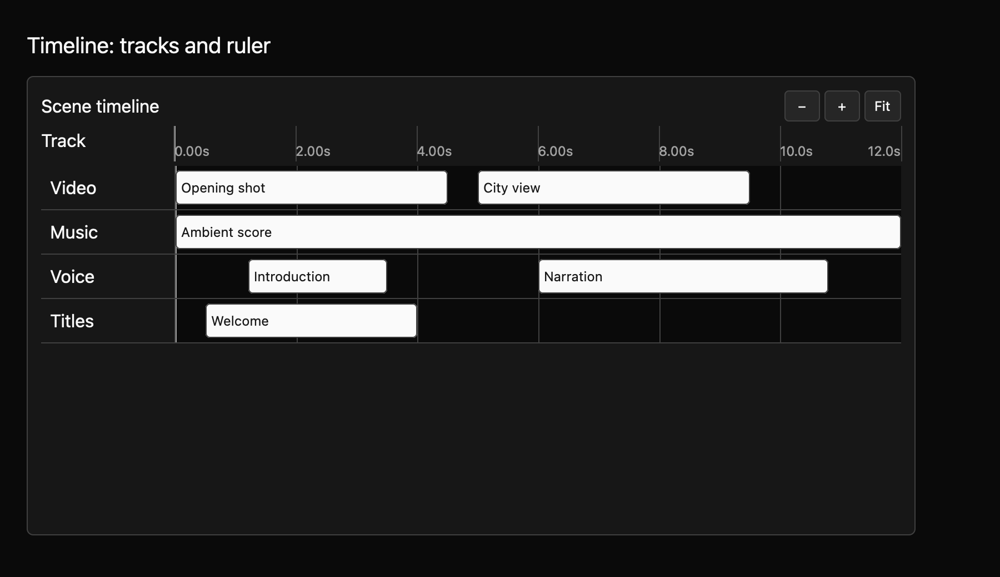

# Timeline: tracks and ruler

This first timeline slice shows app-supplied tracks and clips on a zoomable time axis. It helps an editor make sense of when each item starts and ends. Clips are read-only here. The [T2 playhead and selection guide](timeline-t2.md) covers seeking and selecting; playback, snapping, keyframes, and clip edits belong to later slices.



The [light theme preview](../../images/e8-timeline-t1-light-2x.png) comes from the same compiling example. The macOS harness captures light and dark at 1× and 2×.

## Show tracks

This example has video, music, voice, and title tracks. Each clip has a stable ID, a start and end time in seconds, and a label.

```rust
{{#include ../../../../examples/e8_components/src/lib.rs:timeline_t1_preview}}
```

`TimeRange` describes the visible seconds. In uncontrolled mode, pan and zoom update it locally and emit `VisibleRangeChanged`. In controlled mode, the event proposes a range and the app applies it with `set_visible_range`.

## Navigation

Use `=` or `-` to zoom, Left or Right to pan, and `F` to fit the clip extent. Ctrl or Command plus wheel zooms around the pointer time. A horizontal wheel, or Shift plus vertical wheel, pans time; ordinary vertical wheel scrolls tracks. Hosts can rebind the keyboard actions through `MkitTimeline`.

The timeline exposes named tracks, clips, and a time ruler to the accessibility tree. Eight T1/T2 tests and doc tests pass, and focused Clippy passes with warnings denied. Eight T1/T2 light/dark 1×/2× captures were accepted after inspecting the candidates and their pixel differences. The source contract is in `registry/timeline/spec.md`. Playback, snapping, keyframes, and clip edits belong to later slices (T3/T4). Native accessibility snapshots, sparse and dense state screenshots, and maintainer review of the public API and keyboard contract remain open.
