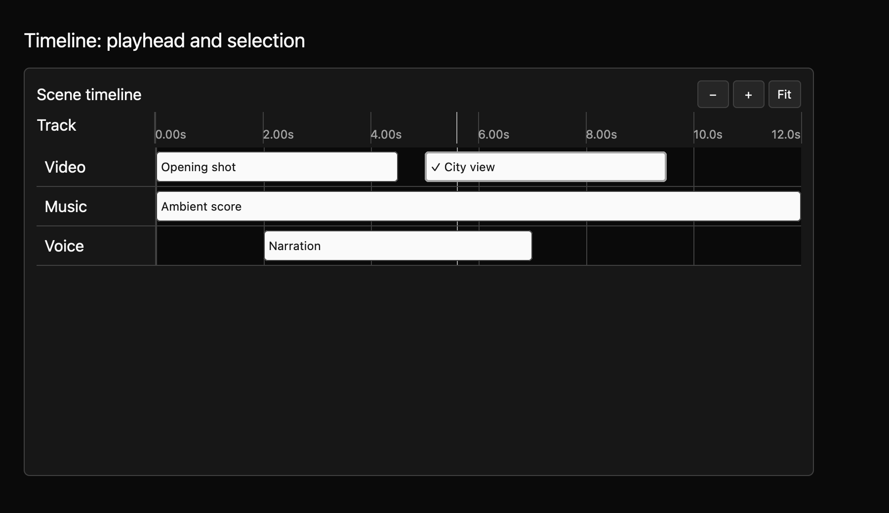

# Timeline: playhead and selection

The T2 timeline adds a playhead and selection to the [tracks and ruler](timeline-t1.md). A playhead marks one time in seconds. Seeking changes that time without starting playback. You can select one track or clip at a time; keyboard focus and selection are separate.



The same preview is available in [light at 2×](../../images/e8-timeline-t2-light-2x.png).

## Add a playhead

This compiling example shows tracks, clips, a visible time range, and a playhead. It also selects a clip so the playhead and selection can be read separately.

```rust
{{#include ../../../../examples/e8_components/src/lib.rs:timeline_t2_preview}}
```

Click or drag on the ruler to seek. A user seek stays within the visible range. An app can set a playhead outside that range, for example when its playback clock keeps running while the timeline is scrolled elsewhere. Times must be finite seconds.

In uncontrolled mode, `Timeline::new` updates its playhead and selection before emitting `PlayheadChanged` or `SelectionChanged`. In controlled mode, `Timeline::controlled` emits requests while showing the supplied values. Apply accepted changes with `set_playhead` and `set_selection`; these setters do not emit user events. A rejected request therefore leaves the owner's values on screen.

## Select and navigate

Click a track label or clip to select it. Up and Down select the previous or next object in track order, then clip time and ID order. Comma and period step the playhead earlier or later by 0.1 seconds, clamped to the visible range. Left and Right still pan the visible range, as in T1. The `MkitTimeline` key context exposes these commands as actions that an app can rebind. Embedded controls keep their own keyboard handling.

The labeled timeline group keeps its named tracks and clips. The playhead exposes a slider value formatted as time in seconds, and each track or clip describes whether it is selected. Selection also has a visible treatment that does not depend on color alone.

The source contract is in `registry/timeline/spec.md`. [T3/T4 add clip editing, snapping, and keyframes](timeline-t3-t4.md). Native screen-reader announcements, physical trackpad behavior, the full state and accessibility matrix, and maintainer review of the public API and keyboard contract remain open.
