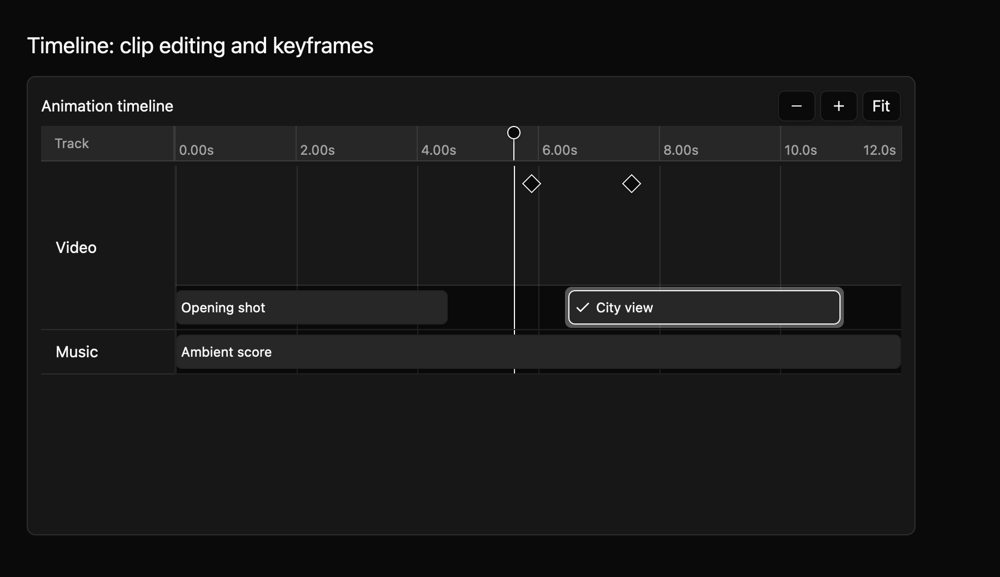
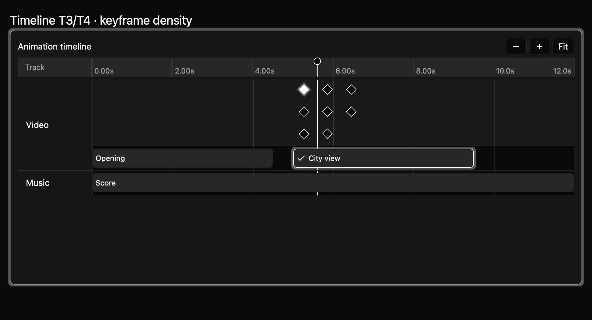

# Timeline: clip editing and keyframes

T3 and T4 add reversible clip and keyframe edits to the [playhead and selection](timeline-t2.md).
This preview shows one selected clip and two keyframes. The app owns the committed media model;
editing requests are typed events. Uncontrolled mode applies a committed edit locally before
emitting; controlled mode waits for the app to update the timeline data.



The same harness capture is available in the [light theme](../../images/e8-timeline-t3-t4-light-2x.png).

The dense-keyframe fixture keeps clip labels separate from a compact marker band. Close markers are
spread across distinct pointer targets while their accessible times stay exact.



```rust
{{#include ../../../../examples/e8_components/src/lib.rs:timeline_t3_t4_preview}}
```

## Moving clips

Drag a clip to move it directly, including onto an adjacent track. Select a clip and press Space to
pick it up for keyboard editing. Shift-Left and Shift-Right move it by one ruler tick
step; Alt-Up and Alt-Down choose an adjacent track. Press Enter to emit `ClipMoveRequested`, or Escape to
cancel. The move preview does not change committed clip data. Snapping considers ruler ticks,
playhead, and clip edges within 8 logical pixels. Press Alt-S to toggle snapping off and on.
Releasing a drag outside all track lanes cancels it, even if the pointer crossed a valid lane.
A valid release uses its final pointer position and target track.

## Moving keyframes

Drag a keyframe marker to move it directly, or navigate markers with Ctrl-Shift-Left and
Ctrl-Shift-Right. Press N to pick up a selected keyframe, then use Shift-Left and Shift-Right to move
it. Enter emits
`KeyframeMoveRequested`; Escape restores the committed marker position. In controlled mode,
`set_keyframes` and `set_tracks` apply the owner's accepted edits. Equal-time markers remain
individually keyboard navigable in stable ID order. Dense or tightly clustered markers use three
compact rows and fan horizontally around their cluster's time position. Extremely large clusters
can extend past the visible track width; use keyboard navigation to reach offscreen markers.

Keyframes have stable IDs and accessible names containing the owner and formatted time. The source
contract is `registry/timeline/spec.md`; its example compiles as part of the pro-app examples. The
dedicated macOS harness captures eight states (clip preview, commit, cancel, keyframe preview,
commit, cancel, selection, and dense keyframes) in light, dark, and high-contrast themes at 1× and
2×. Keyboard
actions are sent through GPUI's input dispatcher, typed move requests are observed, and commit
fixtures apply the owner's accepted model update. Candidate images were visually inspected before
accepting the baselines. Native screen-reader traversal and pointer dragging through synthesized
input remain pending. Registry tests cover invalid pointer releases, stable equal-time navigation,
and dense-marker pointer and keyboard navigation.
