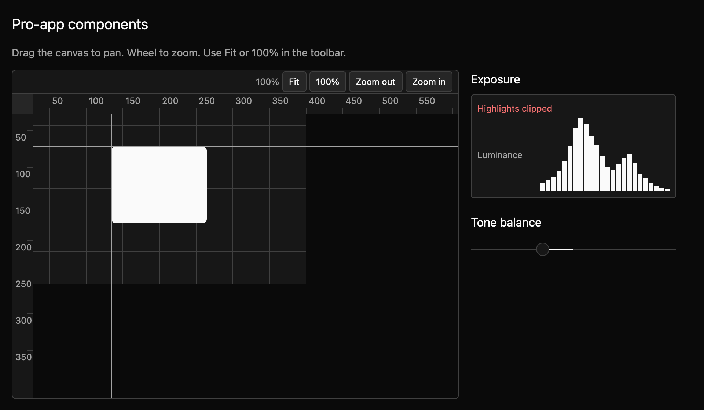
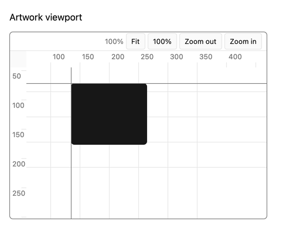
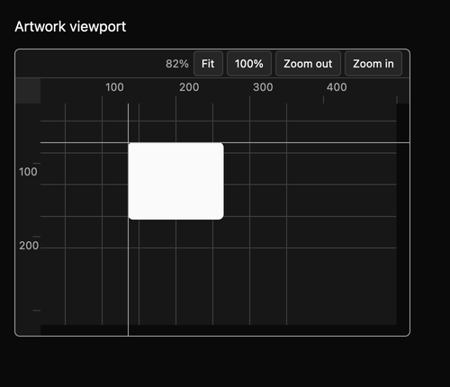

# Viewport

A viewport shows app-drawn content that you can pan and zoom, such as an image, map, or editor canvas. The app supplies the drawing function and content size. The viewport owns the view transform and emits changes when a person moves it. This is an E8.1 draft.



## Use it for

- An image editor canvas where the app paints the photo and selection guides.
- A map whose application owns features and hit testing.
- A node or curve editor that needs stable world-to-screen coordinates.

## Construct and draw

The preview below is a compiling example. It creates an `Entity<Viewport>`, supplies a world extent, and passes an app-owned painter. The same view places a histogram beside it.

```rust
{{#include ../../../../examples/e8_components/src/lib.rs:e8_preview}}
```

The callback receives the canvas bounds and current `ViewTransform`. `world_to_screen` and `screen_to_world` map app scene coordinates to local viewport coordinates. Scale is positive and capped at 16; Fit can choose a smaller scale for very large content. `fit` uses the content extent and theme padding; `actual_size` centers the extent at one world unit per logical pixel. In controlled mode the owner receives `TransformChanged` and applies accepted values with `set_transform`; uncontrolled mode updates itself before emitting.





The example also enables coordinate rulers and supplies two guides in world coordinates. Ruler ticks adapt to zoom, and the guides move with the scene. They are visual overlays; apps should provide separate controls for any guide that people need to edit or discover with a screen reader.

## Keyboard and pointer

| Input | Behavior |
| --- | --- |
| Arrow keys | Pan by a theme spacing step. |
| `=` / `-` | Zoom around the viewport center. |
| `F` | Fit the declared content extent. |
| `1` | Center the content at 100%. |
| Primary drag | Pan by the pointer movement. |
| Space + primary drag | Pan when ordinary drag panning is disabled for scene tools. |
| Mouse wheel | Zoom around the pointer; the world point under it stays fixed. |
| Trackpad scroll | Pan by the pixel scroll displacement. |
| Trackpad pinch | Zoom around the gesture center; the world point beneath it stays fixed. |

Actions live in the `MkitViewport` key context so the host can rebind them. The toolbar exposes Fit, 100%, Zoom out, and Zoom in. The app can disable ordinary drag panning and reserve it for scene tools while leaving Space-drag available. The pinned GPUI version exposes separate pixel scroll and pinch events; a focused GPUI interaction test covers both paths. Physical trackpad behavior on each platform still needs checking.

## Accessibility and appearance

The focusable root requests a group role, a caller-supplied name, and a description of its keys. The toolbar controls request button roles. The app must also expose important scene objects through semantic controls or another navigable representation; painted pixels alone cannot describe them. The quiet frame, toolbar, borders, focus ring, and surfaces read from mkit's GPUI Global theme. [shadcn/ui's component catalog](https://ui.shadcn.com/docs/components) is an aesthetic reference for the compact chrome, not a dependency.

The dedicated harness matrix checks actual-size, fitted, panned, and zoomed states with real keyboard actions in light, dark, and high contrast at 1× and 2×. The checked-in spec is `registry/viewport/spec.md`. Public API, accessibility behavior on a live platform, physical trackpad behavior, and visual baselines still need maintainer review.
