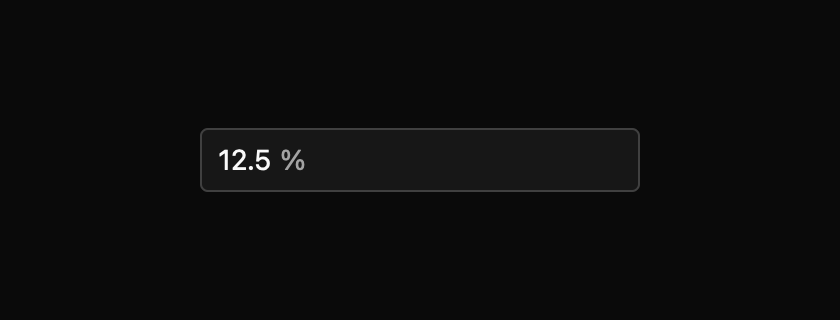

# Scrubbable number field pilot

A scrubbable number field edits a number by typing, pressing keys, or dragging horizontally. The drag gesture is useful for frequent small adjustments in an inspector, while the keyboard and text paths keep the value usable without a pointer. This is a draft registry component; the spec at `registry/scrubbable-number-field/spec.md` tracks the proposed full contract.



The harness also covers its focused, valid-edit, invalid-edit, active-scrub, and disabled states in light, dark, and high-contrast themes at 1× and 2×.

## Create the state

In **uncontrolled** mode, `new` initializes the numeric value and the component stores later changes. Give the field an accessible label and, where appropriate, bounds or a unit suffix:

```rust
{{#include ../../../examples/pilot_components/src/lib.rs:number_uncontrolled}}
```

In **controlled** mode, the owner supplies the value. Listen for `ValueChanged`, decide whether to accept the proposed value, and call `set_value` on the component entity. The displayed committed value follows the owner's value:

```rust
{{#include ../../../examples/pilot_components/src/lib.rs:number_controlled}}
```

The optional `unit("%")` displays a muted suffix and accepts the same suffix on typed input. It does not change the numeric value or the spinbutton's accessible name. These constructor examples compile and run with `cargo test -p mkit-example-pilot-components --lib --locked`. They do not render a window. The separate screenshot matrix renders and compares 36 manifest-declared combinations using real text and pointer input.

## What interaction reports

`ValueChanged` carries the previous value, proposed value, and `ChangeSource` (`Text`, `Keyboard`, or `Pointer`). In controlled mode these are requests; the owner accepts or rejects them by updating the supplied value. `ValueCommitted` carries the candidate and source. Keyboard steps and a valid Enter commit emit both events when the value changes. During a pointer scrub, each value change emits `ValueChanged`; mouse release emits one `ValueCommitted` if the scrub changed the value. An unchanged or clamped action emits no change event. Escape rolls back an active text draft or pointer scrub.

ArrowUp and ArrowDown use `step` (default 1); Shift+Arrow uses one tenth of that step unless `precision_step` is set. PageUp and PageDown use ten steps unless `page_step` is set. Home and End move to a configured minimum or maximum. Enter accepts a valid typed number. An invalid draft returns to the last committed value on Enter. The component declares named actions in the `ScrubbableNumberField` key context so the app can replace default bindings.

A primary-button drag begins scrubbing after more than 3 logical pixels of horizontal movement. The default scale is 4 logical pixels per step. Shift makes pointer changes finer and Alt makes them coarser. A click without a drag focuses the field without changing its value. Pointer cancellation beyond Escape still needs a platform-level check.

## Accessibility and current limits

The current view exposes a spinbutton role, accessible label and description, numeric value, and optional minimum and maximum. Its appearance uses GPUI theme `Global` tokens for text, surface, border, and focus styling. Disabled input suppression and visual treatment are implemented, and the view requests AccessKit disabled state through GPUI's synthetic builder. Live screen-reader behavior and the generated accessibility matrix remain unverified because the headless GPUI test window does not activate AccessKit.

The current pilot uses simple numeric text formatting and suffix units. Locale-aware parsing and formatting remain pending. Native IME and screen-reader output have not been verified, and the component contract, keyboard/accessibility behavior, and screenshot baselines require maintainer review before shipping.
