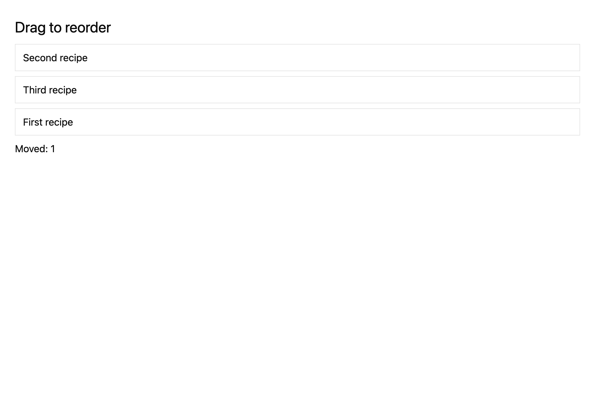

# Reorder rows through GPUI drag and drop

## What you'll build

A list whose rows can be dragged onto another row to change their order.



## Concept

GPUI's `on_drag` starts a typed drag value and `on_drop` receives it at the target. A vector reorder helper changes retained row order.

## Minimal compiling example

```rust
{{#include ../../../../examples/cookbook/src/lib.rs:recipe_drag_reorder_ui}}
```

Run `cargo test -p mkit-example-cookbook --lib --locked`. `rendered_drag_target_reorders_stable_recipe_rows` drives mouse down, move, and up through the rendered targets and asserts row order. The dedicated screenshot shows Second, Third, First and a move count of one.

## How it works

The cookbook view gives each row a selector, starts a drag with its index, and calls `reorder` on drop. The handler increments a counter and notifies the view.

## Exercises

Drag the last row onto the first, then assert all three identities and the reorder count.

## API reference links

- [`gpui::Window`](../../appendices/api-inventory.md)
- [`gpui::Context`](../../appendices/api-inventory.md)
