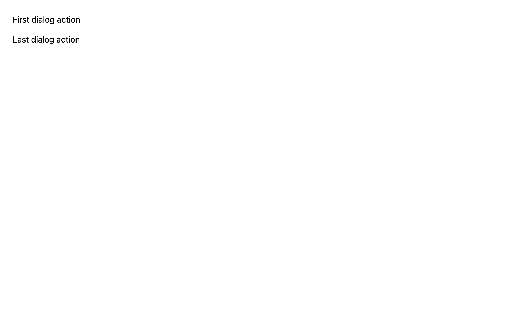

# Wrap focus inside a small modal view

## What you'll build

A two-target modal focus scope with Tab, Shift-Tab, and Escape actions.



## Concept

A `FocusHandle` identifies the focused target. The modal view registers a key context and typed actions to wrap focus at its ends.

## Minimal compiling example

```rust
{{#include ../../../../examples/cookbook/src/lib.rs:recipe_modal_focus_trap}}
```

Run `cargo test -p mkit-example-cookbook --lib --locked`. The screenshot shows the initial modal. `modal_tab_actions_wrap_focus_at_both_ends` checks forward and reverse wrap, then Escape.

## How it works

When open, `ModalFocusTrap` focuses the first target, maps forward and backward actions, and closes on Escape. Its behavior is local to this controlled view; native prompts and screen-reader announcements are separate.

## Exercises

Add a third target and update the boundary assertions so focus still wraps within the modal.

## API reference links

- [`gpui::FocusHandle`](../../appendices/api-inventory.md)
- [`gpui::KeyBinding`](../../appendices/api-inventory.md)
- [`gpui::Window`](../../appendices/api-inventory.md)
