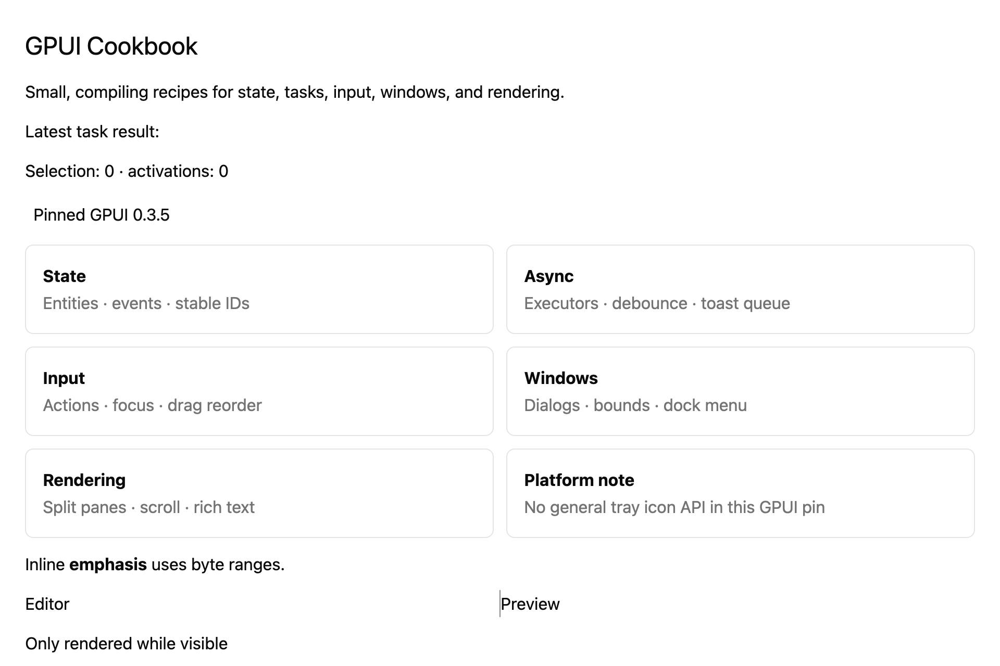

# Build a reusable div helper

## What you'll build

A small status badge built from `div()`.


## Concept

A Rust function can return an element without retaining a new view entity. This helper is not a custom implementation of GPUI's `Element` trait.

## Minimal compiling example

```rust
{{#include ../../../../examples/cookbook/src/lib.rs:recipe_div_component}}
```

Run `cargo test -p mkit-example-cookbook --lib --locked`. The macOS overview baseline shows the badge. There is no separate layout assertion.

## How it works

`status_badge` adds padding and rounded corners around a label. The cookbook view mounts it in the overview.

## Exercises

Pass a second label and compare its rendered bounds in a focused test.

## API reference links

- [`gpui::IntoElement`](../../appendices/api-inventory.md)

