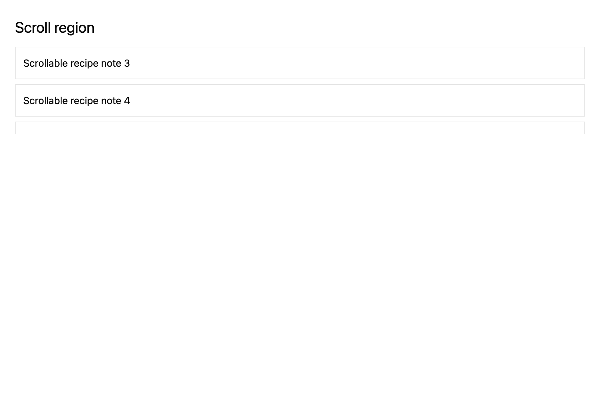

# Make a vertical scroll region

## What you'll build

A bounded area whose content may scroll vertically.



## Concept

`overflow_y_scroll` enables vertical scrolling inside an element with a stable ID.

## Minimal compiling example

```rust
{{#include ../../../../examples/cookbook/src/lib.rs:recipe_scroll_region}}
```

The render view mounts the region:

```rust
{{#include ../../../../examples/cookbook/src/lib.rs:recipe_scroll_view}}
```

Run `cargo test -p mkit-example-cookbook --lib --locked`. `scroll_recipe_has_extent_and_moves_on_wheel_input` checks positive scroll extent and sends a wheel event that changes the tracked offset.

## How it works

`scroll_region` wraps child content. The focused view mounts a recipe list in it; the screenshot shows notes three and four after scrolling.

## Exercises

Send a wheel event in a harness test and assert the tracked scroll offset changes.

## API reference links

- [`gpui::IntoElement`](../../appendices/api-inventory.md)
