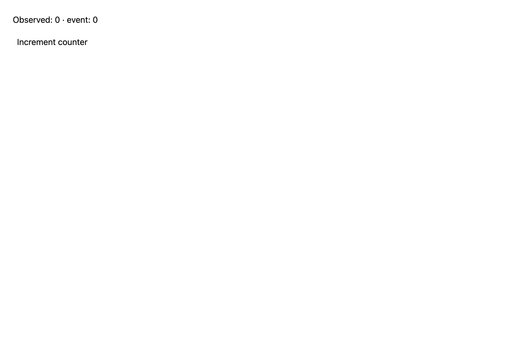

# Increment an entity counter

## What you'll build

A counter whose retained value changes when you click its GPUI view.



## Concept

An `Entity<Counter>` owns the number between draws. `Counter::increment` changes it, emits `CounterChanged`, and calls `cx.notify()` so listeners and the view can update.

## Minimal compiling example

```rust
{{#include ../../../../examples/cookbook/src/lib.rs:recipe_entity_counter}}
```

Run `cargo test -p mkit-example-cookbook --lib --locked`. The screenshot shows the initial zero values. The `counter_updates_observer_and_typed_event_subscriber` test clicks the rendered counter and asserts both observer and event values become one.

## How it works

Pair this anchor with `recipe_observe_entity`: its click handler calls `source.update(cx, Counter::increment)`. The retained field changes once; event delivery and change notification are separate operations.

## Exercises

Change the increment to two and assert both observed values become two.

## API reference links

- [`gpui::Entity`](../../appendices/api-inventory.md)
- [`gpui::Context`](../../appendices/api-inventory.md)
- [`gpui::EventEmitter`](../../appendices/api-inventory.md)
