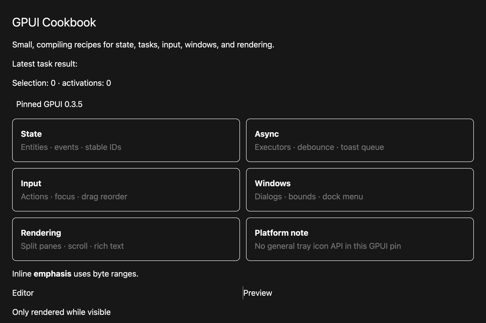

# Toggle an in-app token palette

## What you'll build

A visible switch between two pairs of GPUI Kit theme tokens.




## Concept

This is an in-app palette choice. It does not change the operating system's appearance setting.

## Minimal compiling example

```rust
{{#include ../../../../examples/cookbook/src/lib.rs:recipe_theme_switch}}
```

Run `cargo test -p mkit-example-cookbook --lib --locked`. `theme_action_changes_the_rendered_palette_selection` checks the action; `cookbook.png` and `cookbook-dark.png` capture distinct macOS palette states.

## How it works

`ThemeChoice::token_pair` selects background/foreground or primary/primary-foreground from the active theme. The cookbook `t` action changes the choice and notifies the view.

## Exercises

Add a third token pair and capture a baseline for it. Keep text contrast readable.

## API reference links

- [`gpui::Hsla`](../../appendices/api-inventory.md)
- [`gpui::Context`](../../appendices/api-inventory.md)
