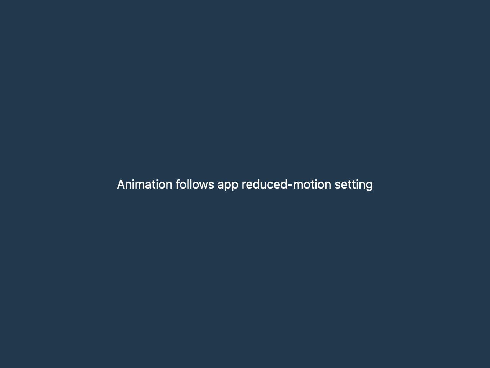

# Animate while respecting reduced motion

## What you'll build

A short opacity animation with quadratic easing and a static end state when reduced motion is enabled. A library test checks the easing and static result; a macOS 1280 × 960, scale-2 baseline shows that reduced-motion endpoint.



## Concept

`Animation::new` sets a duration and defaults to one-shot linear progress. `with_easing` changes how normalized time maps to progress. `AnimationExt::with_animation` wraps an element and, in this pin, respects `App::reduce_motion`: a one-shot animation uses its end state and a repeating animation its start state without scheduling animated frames. See [pinned animation source](https://github.com/zed-industries/zed/blob/d89e9c2124b2786a390c7a451c7488601b4da2e1/crates/gpui/src/elements/animation.rs#L15-L110).

## Minimal compiling example

```rust
{{#include ../../../examples/custom_rendering/src/lib.rs:animation_motion}}
```

Run `cargo test -p mkit-example-custom-rendering --locked`. The `animation_uses_custom_easing_and_reduced_motion_static_end_state` test checks the easing function and the one-shot reduced-motion result. `tests/screenshots.rs` compares the reduced-motion endpoint on macOS, not a timed frame sequence.

## How it works

The helper wraps a `div` in `with_animation` for 240 milliseconds. Its closure maps progress to opacity. The test checks that quadratic easing differs from linear progress and that a one-shot animation settles at its end state when reduced motion is requested. The screenshot shows that static endpoint. Neither check runs a real-time frame sequence or measures smoothness. The [pinned easing functions](https://github.com/zed-industries/zed/blob/d89e9c2124b2786a390c7a451c7488601b4da2e1/crates/gpui/src/elements/animation.rs#L505-L530) include linear and ease-in-out.

## Using the mkit motion tokens

`mkit_core::motion::transition_duration` chooses a hover, press, open, or close duration from the current `Theme` and returns zero when reduced motion is enabled. `transition_animation` creates a GPUI animation from the same token. A host can retain `mkit_core::reduced_motion::watch_system_reduced_motion(cx)` to follow system changes on macOS and Windows; it returns `None` on other platforms. The Windows bridge follows the system animation setting. Linux hosts currently set `App::set_reduce_motion` themselves. The mkit-core tests check the duration mapping and simulated preference updates, but no native settings change has been tested with this example.

## Exercises

Switch from quadratic to ease-in-out and assert a different midpoint while endpoints stay fixed. Add a separate test for the repeating reduced-motion start state before claiming it.

## API reference links

- [`Animation`, `AnimationExt::with_animation`, `App::reduce_motion`, and easing functions](../appendices/api-inventory.md) · [pinned source](https://github.com/zed-industries/zed/blob/d89e9c2124b2786a390c7a451c7488601b4da2e1/crates/gpui/src/elements/animation.rs#L15-L110)
