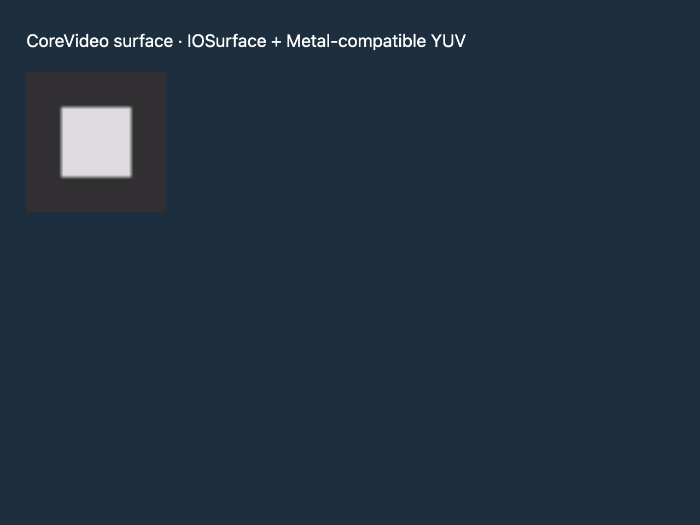

# What surface can show

## What you'll build

A macOS `surface(CVPixelBuffer)` sample that paints a dark square with a bright center. Other targets compile a plain fallback element. The macOS harness captures the 128-pixel display and checks its visible pixels.



## Concept

In pinned GPUI, `surface()` is compiled only on macOS and accepts a `CVPixelBuffer`. Its `SurfaceSource` variant is also macOS-only. `Window::paint_surface` sends that buffer to the platform renderer. The [pinned source](https://github.com/zed-industries/zed/blob/d89e9c2124b2786a390c7a451c7488601b4da2e1/crates/gpui/src/elements/surface.rs#L1-L43) does not expose a portable arbitrary GPU texture handoff through this function. This is a narrow display path, not a general WebGPU, Vulkan, or OpenGL interop promise.

## Minimal compiling example

```rust
{{#include ../../../examples/custom_rendering/src/lib.rs:surface_macos}}
```

Run `cargo test -p mkit-example-custom-rendering --locked`. The macOS screenshot test compares `custom-rendering-surface-macos.png` and asserts that the capture contains more than 1,000 grayscale surface pixels. The non-macOS branch is source-audited but was not compiled by this macOS run; validate it on each claimed target before release.

## How it works

The macOS branch allocates a 32 × 32 full-range, bi-planar YUV Core Video buffer with IOSurface backing and Metal compatibility. It checks plane dimensions and strides, writes a dark Y plane with a bright center and neutral UV values, then gives the buffer to `surface()` at a 128-pixel display size. `SurfaceDemo` mounts it in a labeled panel. Other targets return a `div` explaining the limit. This one buffer and renderer path do not establish zero-copy performance or general GPU interop.

## Exercises

Change the center pattern and compare the captured pixels. Change its fit mode and compare displayed bounds. Compile the fallback on Windows and Linux separately.

## API reference links

- [`surface`, `Surface`, `SurfaceSource`, `ObjectFit`, and `Window::paint_surface`](../appendices/api-inventory.md) · [pinned surface source](https://github.com/zed-industries/zed/blob/d89e9c2124b2786a390c7a451c7488601b4da2e1/crates/gpui/src/elements/surface.rs#L1-L100)
