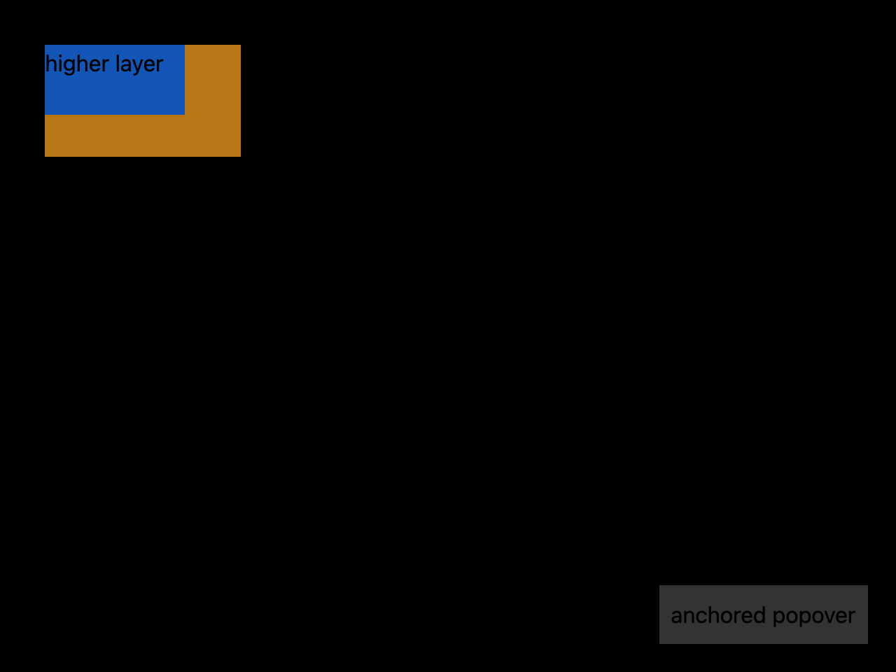

# Place overlays above content

## What you'll build

An anchored popover near a window edge and two overlapping deferred elements with explicit priority. The macOS harness has a dedicated 1280 × 960, scale-2 screenshot for their initial draw order and placement.



## Concept

`anchored()` adjusts placement so child content avoids overflowing the window. `deferred()` postpones a child's layout and paint while it remains in the element tree. `Deferred::with_priority` sets relative deferred draw order; higher priority draws on top. It does not set pointer hit order. See [pinned anchored](https://github.com/zed-industries/zed/blob/d89e9c2124b2786a390c7a451c7488601b4da2e1/crates/gpui/src/elements/anchored.rs#L16-L76) and [deferred](https://github.com/zed-industries/zed/blob/d89e9c2124b2786a390c7a451c7488601b4da2e1/crates/gpui/src/elements/deferred.rs#L7-L78).

## Minimal compiling example

```rust
{{#include ../../../examples/custom_rendering/src/lib.rs:overlay_layers}}
```

Run `cargo test -p mkit-example-custom-rendering --locked`. `tests/screenshots.rs` compares `custom-rendering-overlay.png` on macOS. The library test checks that the popover fits the window and clicks the overlapping layers. It does not test keyboard focus.

## How it works

The helper gives its deferred children priorities 1 and 2, then anchors a popover near the lower-right edge with an 8-pixel window margin. `OverlayDemo` mounts the helper for the screenshot. The blue higher-priority layer is visible over the amber lower-priority layer. In the overlapping area, the test's mouse-down reaches the lower layer. Visual order therefore does not establish click routing in this fixture. The bounds test covers this viewport, not every edge case. The helper does not trap focus or define accessibility behavior.

## Dismissing nested mkit overlays

`mkit_core::overlay` adds named layer priorities and a dismissal policy for outside pointer presses and Escape. The interaction example mounts two nested overlays, registers a rebindable Escape action in a key context, and lets only the top overlay handle an outside press. Its headless tests check that one press dismisses one layer, that a rebound key invokes dismissal, and that uncovered background input still works. The [nested overlay screenshot](../images/e4-overlay-nested.png) compares the initial light-theme state at 1280 × 960, scale 2. Deferred paint priority does not block input behind a modal surface; a modal component must provide its own input barrier and focus behavior.

## Exercises

Reverse the two priorities and compare a screenshot and overlap click. Move the anchor near each edge and check its final bounds. Add an explicit hit-routing design for any interactive overlay.

## API reference links

- [`Anchored`, `Deferred`, and `Deferred::with_priority`](../appendices/api-inventory.md) · [pinned layering source](https://github.com/zed-industries/zed/blob/d89e9c2124b2786a390c7a451c7488601b4da2e1/crates/gpui/src/elements/deferred.rs#L7-L78)
