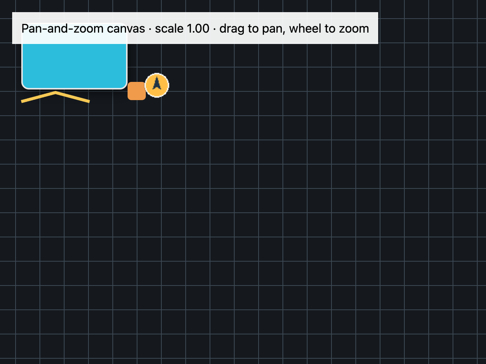
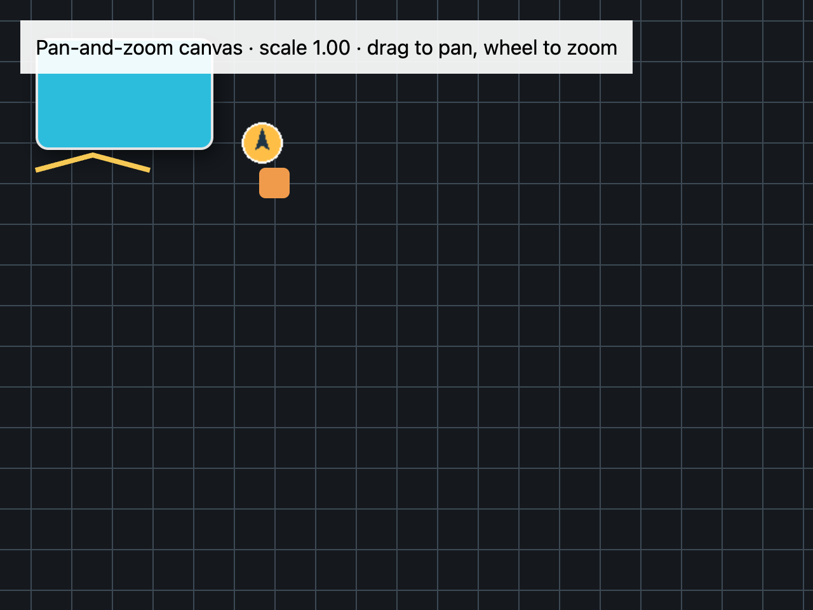
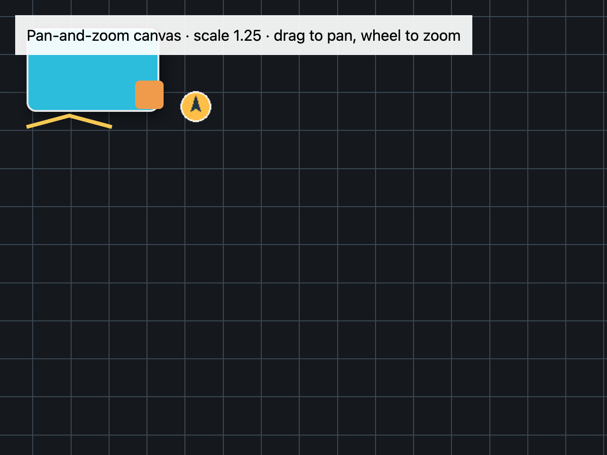

# Build a pan-and-zoom canvas

## What you'll build

A fixed grid and marker that you can drag to pan and zoom around the pointer with the mouse wheel. Run `cargo run -p mkit-example-custom-rendering --locked`. The macOS harness captures initial, panned, and zoomed states at 1280 × 960 pixels, scale 2.







## Concept

The view retains a transform: an origin offset and scale. The canvas paints world coordinates after applying that transform. Pointer events update the origin; wheel input changes scale. Zooming around the pointer requires keeping the world point under that pointer at the same screen position. `canvas()` supplies the paint callbacks, while pinned [pointer listeners](https://github.com/zed-industries/zed/blob/d89e9c2124b2786a390c7a451c7488601b4da2e1/crates/gpui/src/elements/div.rs#L126-L390) and [scroll-wheel event](https://github.com/zed-industries/zed/blob/d89e9c2124b2786a390c7a451c7488601b4da2e1/crates/gpui/src/interactive.rs#L354-L375) supply input.

## Minimal compiling example

```rust
{{#include ../../../examples/custom_rendering/src/lib.rs:pan_zoom_view}}
```

```rust
{{#include ../../../examples/custom_rendering/src/main.rs:pan_zoom_main}}
```

Run `cargo test -p mkit-example-custom-rendering --locked`. The library tests check transform math and pointer/wheel dispatch. `tests/screenshots.rs` compares all three macOS baselines.

## How it works

`PanZoomView` retains an offset and scale clamped to 0.35–3.0. A left-button drag adds pointer movement to the offset and calls `cx.notify()`. A wheel event converts the pointer to a world point, changes scale, then adjusts the offset to keep that world point under the pointer. The numeric test checks the inverse mapping and this invariant; the input test dispatches drag and wheel events. The three screenshots compare the visible states. There is no Reset action in this example.

## Exercises

Zoom in and out around an off-center pointer; assert the chosen world point remains under it. Add a Reset action that restores `ViewTransform::default()` and compare the initial screenshot. Repeat at another scale only after adding an explicit baseline.

## API reference links

- [`canvas`, pointer listeners, and `ScrollWheelEvent`](../appendices/api-inventory.md) · [pinned canvas source](https://github.com/zed-industries/zed/blob/d89e9c2124b2786a390c7a451c7488601b4da2e1/crates/gpui/src/elements/canvas.rs#L10-L91)
