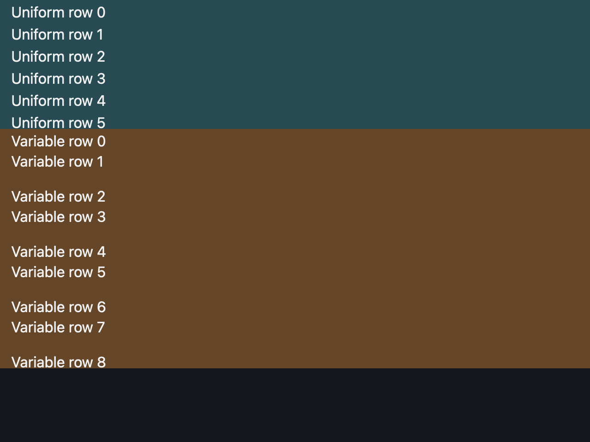

# Render only visible list items

## What you'll build

Two bounded 1,000-row lists: one with uniform row height and one with variable row height. A test checks that each branch renders fewer than all 1,000 rows; a macOS 1280 × 960, scale-2 baseline shows their initial visible slices.



## Concept

*Virtualization* renders the visible slice instead of all items. `uniform_list` uses one measured row height and calls its renderer for visible ranges in a bounded viewport. `list` supports different heights using a retained `ListState`; when offscreen heights change, its source requires `splice` or `reset`. See [pinned uniform list](https://github.com/zed-industries/zed/blob/d89e9c2124b2786a390c7a451c7488601b4da2e1/crates/gpui/src/elements/uniform_list.rs#L1-L53) and [variable-height list](https://github.com/zed-industries/zed/blob/d89e9c2124b2786a390c7a451c7488601b4da2e1/crates/gpui/src/elements/list.rs#L1-L53).

## Minimal compiling example

```rust
{{#include ../../../examples/custom_rendering/src/lib.rs:virtualized_lists}}
```

Run `cargo test -p mkit-example-custom-rendering --locked`. The `virtualized_lists_render_visible_uniform_and_variable_rows` test checks that both branches produce only a visible slice; `tests/screenshots.rs` compares the initial rows on macOS.

## How it works

The helper builds a 140-pixel-high `uniform_list` and a 260-pixel-high variable-height `list`, each with 1,000 rows. `ListState` tracks the latter's layout. The test verifies that initial rendering does not request all rows. It does not scroll or mutate offscreen row heights, so those behaviors remain exercises rather than tested results.

## Exercises

Double the item count and verify the initial rendered count still follows viewport size. Then add a scroll test that records requested ranges before and after movement. For a changed offscreen row height, call the documented `ListState` update and assert scroll position.

## API reference links

- [`uniform_list`, `list`, `UniformList`, `ListState`](../appendices/api-inventory.md) · [pinned uniform list](https://github.com/zed-industries/zed/blob/d89e9c2124b2786a390c7a451c7488601b4da2e1/crates/gpui/src/elements/uniform_list.rs#L1-L53)
