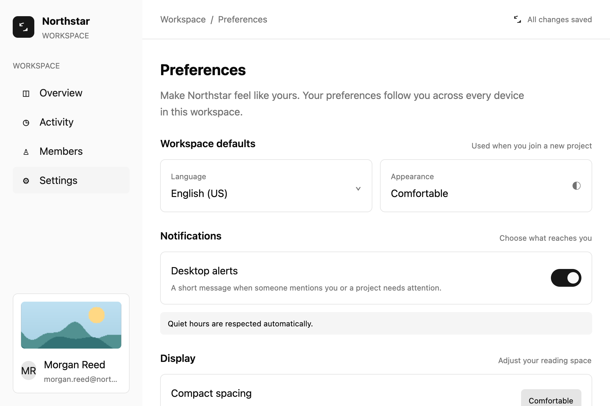
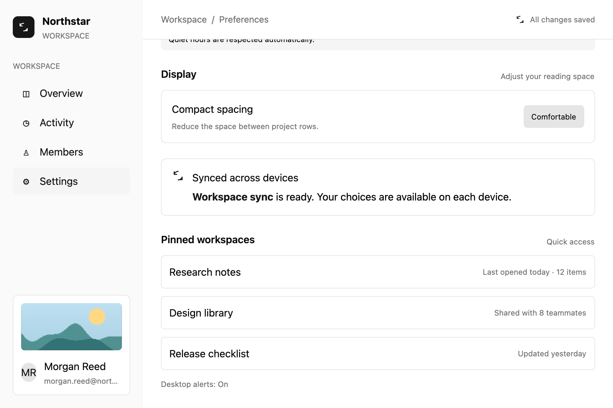

# Build conditional rows and lists

## What you'll build

Show one of two notification notes when the desktop-alert setting changes, and render the pinned-workspace list from data. Run `cargo run -p mkit-example-settings-screen` from the workspace root. The library test checks the notification switch and its changed note; both harness images use the initial notification state.





## Concept

An element tree can choose a child with ordinary Rust `if` or [`FluentBuilder::when`](https://github.com/zed-industries/zed/blob/d89e9c2124b2786a390c7a451c7488601b4da2e1/crates/gpui/src/util.rs#L11-L52). [`ParentElement::children`](https://github.com/zed-industries/zed/blob/d89e9c2124b2786a390c7a451c7488601b4da2e1/crates/gpui/src/element.rs#L201-L208) accepts an iterator, so a data array can produce a row per entry.

For an interactive row, [`InteractiveElement::id`](https://github.com/zed-industries/zed/blob/d89e9c2124b2786a390c7a451c7488601b4da2e1/crates/gpui/src/elements/div.rs#L774-L789) assigns an [`ElementId`](../appendices/api-inventory.md) and returns a stateful wrapper. GPUI combines such IDs into a [`GlobalElementId`](https://github.com/zed-industries/zed/blob/d89e9c2124b2786a390c7a451c7488601b4da2e1/crates/gpui/src/element.rs#L210-L215) to track state across frames. Give dynamic interactive rows IDs derived from stable data keys; a row's current position may change.

## Minimal compiling example

The notification control and keyed workspace list are both compiled in the settings-screen crate:

```rust
{{#include ../../../examples/settings_screen/src/lib.rs:settings_screen_conditionals}}
```

```rust
{{#include ../../../examples/settings_screen/src/lib.rs:settings_screen_list}}
```

Run `cargo run -p mkit-example-settings-screen`. Run `cargo test -p mkit-example-settings-screen --lib --locked` for the conditional note assertion and scroll interaction. On macOS, `cargo test -p mkit-example-settings-screen --test screenshot --locked` compares top and bottom 1920 × 1280 images at scale 2.0; the bottom image shows the three list rows. Windows and Linux compile the screenshot test but report unsupported headless capture.

## How it works

`notification_section` selects an enabled or disabled note from the current state. `setting_row` gives its row and toggle IDs derived from the setting key. The toggle's click handler changes `notifications_enabled` in its [`Entity`](../appendices/api-inventory.md) and calls `cx.notify()`; the retained view observes the model and redraws, choosing the other note. The test clicks the debug-selected toggle and checks that the old note is gone, the new note is present, and the stored setting is false.

`saved_places` maps three stable place IDs to children. Each row's `pinned-workspace-{id}` identity follows the place, while the displayed names and details remain ordinary child text. The example does not reorder rows, so it demonstrates stable ID construction but does not test state preservation during reordering.

## Exercises

1. Add a fourth pinned workspace with a new stable ID. Run the app and confirm the new row appears. Keep IDs distinct.
2. Click **Desktop alerts** and confirm the note changes. Run the library test to check the same state transition, then return the app to its initial state before comparing the screenshot.

## API reference links

- [`ParentElement`, `InteractiveElement`, `ElementId`, `GlobalElementId`, and `Entity`](../appendices/api-inventory.md) — list construction, row identity, and state.
- [`FluentBuilder`](../appendices/api-inventory.md) — optional fluent conditional construction; the example uses Rust `if` for its notification note.
