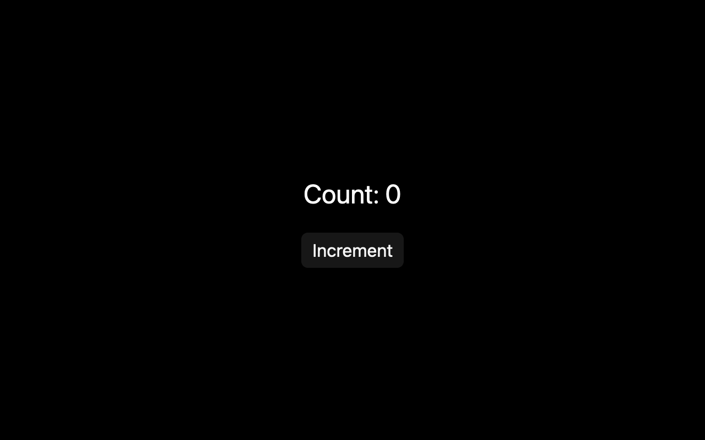

# Counter, line by line

## What you'll build

Build a window that shows `Count: 0` and an **Increment** button. Each click raises the count by one. Run it from the workspace root with `cargo run -p mkit-example-counter`.



## Concept

The count belongs to a GPUI [entity](../appendices/api-inventory.md): a handle to data that stays alive between renders. The `Counter` type implements [`Render`](../appendices/api-inventory.md), so GPUI can ask it for the current element tree. The [pinned `Render` contract](https://github.com/zed-industries/zed/blob/d89e9c2124b2786a390c7a451c7488601b4da2e1/crates/gpui/src/element.rs#L160-L166) returns a new description of the view from its retained data.

The button comes from **GPUI Kit**, the application-facing component library used here. Its click callback holds an [`Entity<Counter>`](../appendices/api-inventory.md) handle. The callback calls [`Entity::update`](https://github.com/zed-industries/zed/blob/d89e9c2124b2786a390c7a451c7488601b4da2e1/crates/gpui/src/app/entity_map.rs#L474-L482) to change the count, then [`Context::notify`](https://github.com/zed-industries/zed/blob/d89e9c2124b2786a390c7a451c7488601b4da2e1/crates/gpui/src/app/context.rs#L228-L232) to tell GPUI that the view changed. [How GPUI thinks](../getting-started/how-gpui-thinks.md) explains the draw that follows.

## Minimal compiling example

This view is included from the compiling `examples/counter` crate:

```rust
{{#include ../../../examples/counter/src/lib.rs:counter_view}}
```

The binary initializes GPUI Kit and opens the counter as the root view:

```rust
{{#include ../../../examples/counter/src/main.rs:counter_main}}
```

Run `cargo run -p mkit-example-counter`. On macOS, `cargo test -p mkit-example-counter --test screenshot --locked` compares the initial 1280 × 800, scale 2.0 render with the PNG above. On Windows and Linux, that test checks the pinned GPUI version's unsupported headless screenshot path. The separate `cargo test -p mkit-example-counter --lib --locked` test clicks the button and checks that the retained count becomes one.

## How it works

1. `#[derive(Default)]` gives `Counter` a starting `count` of zero. The field stays in the entity between renders.
2. `impl Render for Counter` defines the view. `let count = self.count` reads the current value to build the label. `let counter = cx.entity()` gets a handle to this same entity, using the pinned [`Context::entity` method](https://github.com/zed-industries/zed/blob/d89e9c2124b2786a390c7a451c7488601b4da2e1/crates/gpui/src/app/context.rs#L52-L60).
3. `div().size_full().flex().flex_col()` makes a full-window column. The next layout calls center its children and set their gap. The first child formats the current count as text.
4. The outer `div().debug_selector(|| "increment".into())` gives the interaction test a stable way to find the button's bounds. It does not change the visible label. `Button::new("increment-button").primary().label("Increment")` creates the GPUI Kit button with its own identifier, primary variant, and visible label. The `on_click` closure is the handoff from the Kit component to this app's state logic.
5. `move` captures the entity handle in that closure. The button supplies a mutable app context when clicked. `counter.update(cx, |this, cx| ...)` then borrows the `Counter` data as `this` and gives the inner closure its own [`Context<Counter>`](../appendices/api-inventory.md).
6. `this.count += 1` changes retained data. `cx.notify()` tells observers and displayed windows that this entity changed. The pinned [notification path](https://github.com/zed-industries/zed/blob/d89e9c2124b2786a390c7a451c7488601b4da2e1/crates/gpui/src/app.rs#L2730-L2765) invalidates windows that currently show it. On its next draw, the label can use the new count.
7. In `main`, `gpui_kit::init(cx)` initializes the Kit layer. `open_window` creates the root with `cx.new(|_| Counter::default())`, and `activate(true)` brings the app forward.

## Common mistakes

**Updating the field but omitting `cx.notify()`.** The count changes in the entity, yet the displayed subtree may stay cached. Keep notification inside the `Entity::update` closure after the mutation. [Zed GPUI discussion #45246](https://github.com/zed-industries/zed/discussions/45246) proposes making notification automatic; it does not describe an API available in the pinned `gpui-pre` 0.3.5. The pinned [view cache condition](https://github.com/zed-industries/zed/blob/d89e9c2124b2786a390c7a451c7488601b4da2e1/crates/gpui/src/view.rs#L385-L410) shows why an unchanged view may be reused.

## Exercises

1. Change `this.count += 1` to add two. Run the app, click once, and check for `Count: 2`. Restore the increment before comparing the existing screenshot baseline.
2. Change the default count to three. Run the app and check for `Count: 3` before clicking. Restore zero before running the screenshot test, which expects the initial state shown above. Run `cargo test -p mkit-example-counter --lib --locked` to check the click path.

## API reference links

- [`gpui::Entity`, `gpui::Context`, and `gpui::Render`](../appendices/api-inventory.md) — retained data, update context, and the view contract. GPUI Kit reexports these GPUI APIs.
- [`gpui::Window`, `gpui::App`, and `gpui::AppContext`](../appendices/api-inventory.md) — the window and app APIs used in `main`.
- [GPUI Kit 0.6.4](https://docs.rs/gpui-kit/0.6.4/gpui_kit/) — the facade that exposes the `Button` component used by this example.
