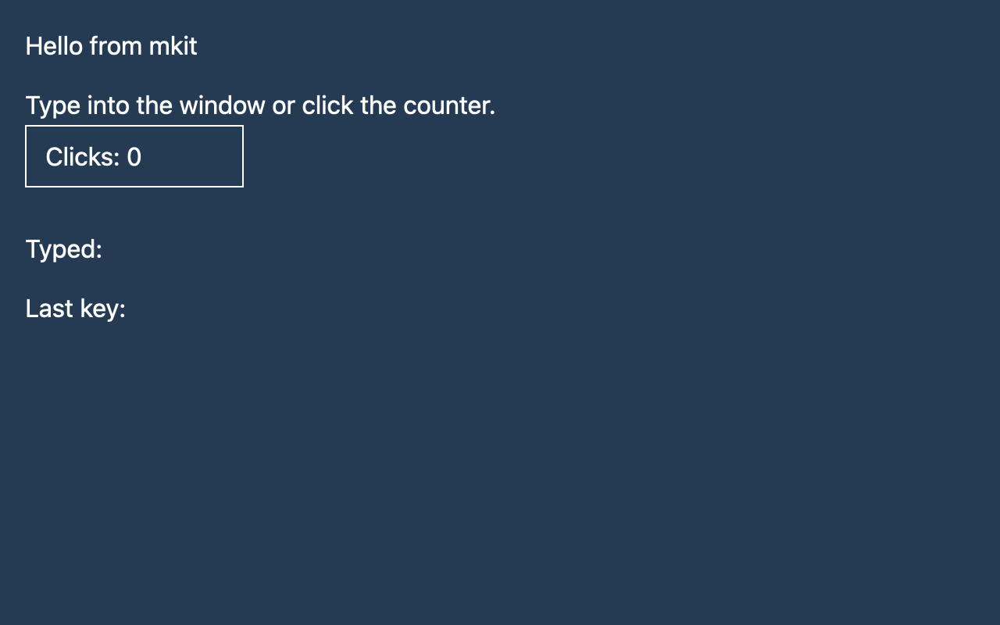

# How GPUI thinks

## What you'll build

You will run the hello window and trace what happens when you click its counter. The number stays in the view's state. The visible text changes after GPUI draws an updated frame.



Run `cargo run -p mkit-example-hello` from the workspace root. Click **Clicks** to change the count.

## Concept

GPUI uses an immediate-style *render method*: a view describes the elements it wants to show from its current data. The data itself lives longer than one frame. A [view](../appendices/api-inventory.md) is an [entity](../appendices/api-inventory.md) whose type implements [`Render`](../appendices/api-inventory.md). Its `render` method returns an element tree rather than storing that tree as the app's state. The [pinned trait definition](https://github.com/zed-industries/zed/blob/d89e9c2124b2786a390c7a451c7488601b4da2e1/crates/gpui/src/element.rs#L160-L166) makes that contract explicit.

Think of the counter as two things: the retained `clicks` field, and a fresh description such as `"Clicks: 1"` when the view renders. A click changes `clicks`. Calling [`Context::notify`](https://github.com/zed-industries/zed/blob/d89e9c2124b2786a390c7a451c7488601b4da2e1/crates/gpui/src/app/context.rs#L228-L232) tells GPUI that the entity changed. GPUI can then invalidate the windows that display it; [the pinned notification path](https://github.com/zed-industries/zed/blob/d89e9c2124b2786a390c7a451c7488601b4da2e1/crates/gpui/src/app.rs#L2730-L2765) checks which windows currently track that entity.

"Immediate-style" does **not** mean every view's `render` method runs on every frame. The pinned [view element implementation](https://github.com/zed-industries/zed/blob/d89e9c2124b2786a390c7a451c7488601b4da2e1/crates/gpui/src/view.rs#L380-L415) can reuse a stateful view's unchanged subtree. This keeps the programming model simple while avoiding some repeated layout and paint work.

## Minimal compiling example

The following code comes from the compiling `mkit-example-hello` crate. Its state fields remain on `InspectorFixture`; the `div()` calls describe what to show from those fields.

```rust
{{#include ../../../examples/hello/src/lib.rs:hello_view}}
```

The runnable app creates that view as a window's root entity:

```rust
{{#include ../../../examples/hello/src/main.rs:hello_main}}
```

Run `cargo run -p mkit-example-hello`. On macOS, `cargo test -p mkit-example-hello --test screenshot` compares the initial 1280 × 800 frame at scale 2.0 with the image above. The pinned GPUI version has no headless screenshot renderer on Windows or Linux, so the test checks and reports that limitation there.

## How it works

1. `InspectorFixture::hello()` creates the view data with `clicks` set to zero. `cx.new(...)` stores it as an entity, and `cx.open_window(...)` makes it the window's root.
2. GPUI calls `InspectorFixture::render` when it needs the view's element description. The method reads `self.clicks`, `self.typed`, and `self.last_key`, then builds a `div()` tree. That tree contains the current **Clicks** text and event handlers.
3. A click handler increments `this.clicks` and calls `cx.notify()`. The key handler updates text and also calls `cx.notify()`. Both handlers change retained data; they do not edit an existing text element in place.
4. On a draw, GPUI [marks invalidated views dirty](https://github.com/zed-industries/zed/blob/d89e9c2124b2786a390c7a451c7488601b4da2e1/crates/gpui/src/window.rs#L3309-L3319), then [lays out, prepares, and paints](https://github.com/zed-industries/zed/blob/d89e9c2124b2786a390c7a451c7488601b4da2e1/crates/gpui/src/window.rs#L3387-L3465) the window's root elements. It swaps the completed next frame into the rendered frame and marks it for presentation. [Presentation sends the scene to the platform window](https://github.com/zed-industries/zed/blob/d89e9c2124b2786a390c7a451c7488601b4da2e1/crates/gpui/src/window.rs#L3320-L3336). A redraw can reuse unchanged view work, so this is the logical flow rather than a promise that every method runs each frame.

The example gives its root a focus handle and handles `KeyDownEvent`. It demonstrates a focused keyboard listener, but it does not define rebindable actions or an accessibility role for the counter. Later chapters cover those contracts.

## Common mistakes

**Changing state without notifying GPUI.** The field changes, but a view that relies on it may continue to show its cached result. Call `cx.notify()` after a state change that must update the view, as both hello handlers do. An [official Zed GPUI discussion about automatic notification](https://github.com/zed-industries/zed/discussions/45246) asks whether this explicit call could be omitted; it is a proposal, not behavior provided by the pinned `gpui-pre` 0.3.5 API. The pinned [context method](https://github.com/zed-industries/zed/blob/d89e9c2124b2786a390c7a451c7488601b4da2e1/crates/gpui/src/app/context.rs#L228-L232) and [view cache condition](https://github.com/zed-industries/zed/blob/d89e9c2124b2786a390c7a451c7488601b4da2e1/crates/gpui/src/view.rs#L385-L410) explain the correction.

## Exercises

1. Change the initial value of `clicks` in `InspectorFixture::new`. Run the app and check that the first frame displays the new number. Restore zero before running the existing screenshot baseline test.
2. Temporarily remove `cx.notify()` from the click handler. Run the app and click once. Observe when the text changes, then restore the call and repeat. Do not rely on another event to refresh the view.

## API reference links

- [`gpui::Entity`, `gpui::Render`, and `gpui::Context`](../appendices/api-inventory.md) — the retained state handle, view contract, and entity context. This workspace imports the package as `gpui_pre`.
- [`gpui::Window` and `gpui::AppContext`](../appendices/api-inventory.md) — the window and app methods used to create the root view.
- [`gpui::KeyDownEvent` and `gpui::FocusHandle`](../appendices/api-inventory.md) — the hello view's keyboard event and focus handle.
