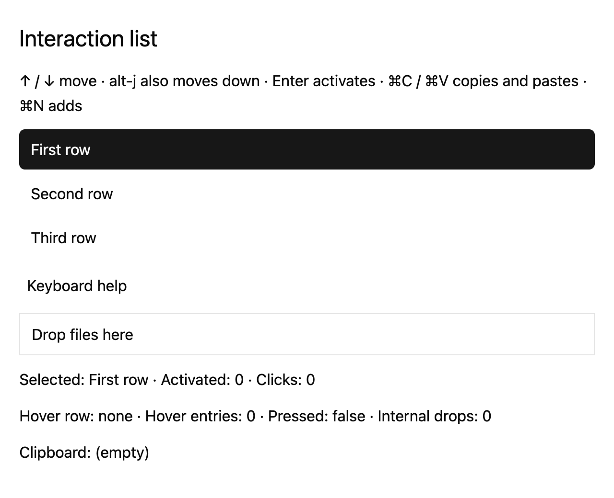

# Focus and tab order

## What you'll build

A keyboard list with one initial focus target and a second “Keyboard help” target. Run `cargo run -p mkit-example-interaction --locked` from the workspace root.



## Concept

*Focus* is the target for keyboard input. A `FocusHandle` identifies that target. `track_focus` associates an element with it; `tab_stop` and `tab_index` place elements in tab order. `focus_visible` applies a style when keyboard focus should be shown. `Window::focus_next` and `focus_prev` use tab stops in the rendered frame, so a new element may need to render before traversal can find it. See [focus handle](https://github.com/zed-industries/zed/blob/d89e9c2124b2786a390c7a451c7488601b4da2e1/crates/gpui/src/window.rs#L527-L628) and [tab traversal](https://github.com/zed-industries/zed/blob/d89e9c2124b2786a390c7a451c7488601b4da2e1/crates/gpui/src/window.rs#L2311-L2333).

## Minimal compiling example

This focus setup comes from the compiling `examples/interaction/src/lib.rs`.

```rust
{{#include ../../../examples/interaction/src/lib.rs:interaction_focus}}
```

Run `cargo test -p mkit-example-interaction --lib --locked`. The macOS screenshot above is checked by `cargo test -p mkit-example-interaction --test screenshot --locked` at 1280 × 1040 and scale 2.0. The pinned headless renderer has no baseline on other platforms.

## How it works

The entity creates and retains a `FocusHandle` for the list and another for the help target. It initially focuses the list. The list uses `track_focus`, `tab_group`, and `focus_visible`; the help target also tracks focus. The test verifies initial list focus and one `Window::focus_next` move to help. It does not verify Shift-Tab or reverse traversal. The listbox role and selected properties are set, but the harness has no accessibility snapshot for this example; the accessibility contract still needs maintainer review.

## Common mistakes

**Typing reaches the dialog container rather than its input.** [Zed discussion #57205](https://github.com/zed-industries/zed/discussions/57205) describes this symptom and explains that calling `focus_next` before the new frame has tab stops may miss the input. That discussion concerns a later Zed revision. For an overlay in this fixture, render the target and explicitly focus its handle, then test initial focus.

## Exercises

Use the arrow keys while the list has focus; selection should change. Move focus to “Keyboard help” and verify list actions stop receiving keys. Add a test for reverse traversal before documenting Shift-Tab behavior.

## API reference links

- [`FocusHandle`, `track_focus`, `tab_group`, `focus_visible`, `Window::focus_next`](../appendices/api-inventory.md) · [pinned element source](https://github.com/zed-industries/zed/blob/d89e9c2124b2786a390c7a451c7488601b4da2e1/crates/gpui/src/elements/div.rs#L794-L845)
