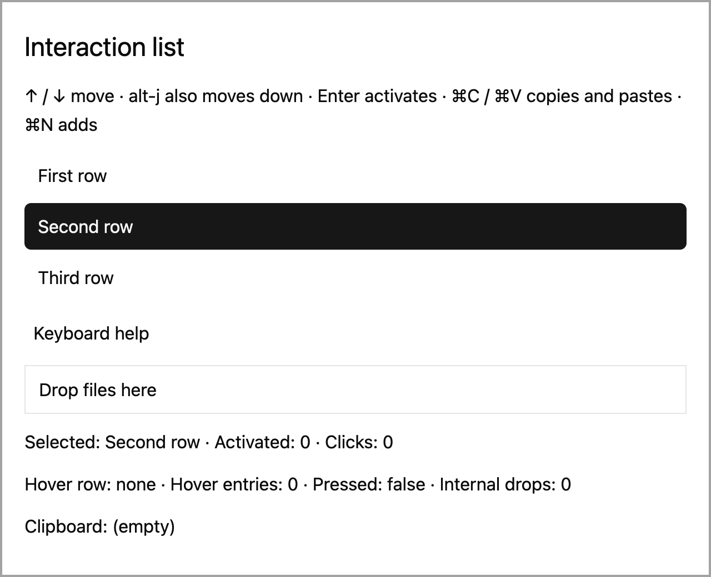

# A keyboard-driven list

## What you'll build

A small list whose selected row moves with arrow keys and pointer clicks. Enter activates the selection. The example binds an alternate key to Move Down. Run `cargo run -p mkit-example-interaction --locked` from the workspace root. Set a startup override with `MKIT_MOVE_DOWN_KEY=ctrl-k cargo run -p mkit-example-interaction --locked`.




## Concept

An *entity* keeps the list's selected index between renders. The view renders that state each frame. A focus handle directs keyboard input to the list; a key context chooses applicable bindings. Actions give the shortcuts command names, so a changed binding can call the same command. The [pinned dispatch guide](https://github.com/zed-industries/zed/blob/d89e9c2124b2786a390c7a451c7488601b4da2e1/crates/gpui/src/key_dispatch.rs#L1-L52) explains context precedence.

## Minimal compiling example

The view and app entry point come from the compiling interaction example.

```rust
{{#include ../../../examples/interaction/src/lib.rs:interaction_list}}
```

```rust
{{#include ../../../examples/interaction/src/main.rs:interaction_main}}
```

Run `cargo test -p mkit-example-interaction --lib --locked` for the keyboard, pointer, focus, drag, and clipboard assertions. Both screenshots above are checked by `cargo test -p mkit-example-interaction --test screenshot --locked` on macOS at 1280 × 1040 and scale 2.0.

## How it works

The `InteractionList` entity keeps rows, selected index, and activity counts between renders. `move_up` and `move_down` clamp the index to the available rows. The focused root declares the `InteractionList` key context and handles typed actions; row clicks set the selected index directly. Each mutation calls `notify` to redraw. The test supplies Ctrl-K as an alternate Move Down binding, checks two moves and Enter activation, and separately checks pointer selection. The keyboard screenshot dispatches Down and checks that row two is selected before capture. The view sets `ListBox` and `ListBoxOption` roles and selected properties. There is no accessibility snapshot yet, so the complete listbox keyboard contract needs maintainer review. The focus test verifies forward `focus_next` traversal only.

## Common mistakes

**A renamed shortcut changes behavior only in one context.** [Zed issue #61941](https://github.com/zed-industries/zed/issues/61941) reports a later Zed case where a replacement shortcut did not match the original command across contexts. The report is a prompt to test the whole action path, not proof of a defect in this fixture. Register the alternate key for the intended context and assert the selected row and activation result.

## Exercises

Move down twice, up once, then press Enter. Check the selected label and activation count. Repeat with the startup alternate key and confirm the help text shows it. Click a row and check that selection moves to it. Add a focus-visible screenshot if you need visual evidence beyond the selected-state baseline.

## API reference links

- [`Entity`, `FocusHandle`, `actions!`, `KeyBinding`, `key_context`, `on_action`](../appendices/api-inventory.md) · [pinned action dispatch](https://github.com/zed-industries/zed/blob/d89e9c2124b2786a390c7a451c7488601b4da2e1/crates/gpui/src/key_dispatch.rs#L1-L52)
