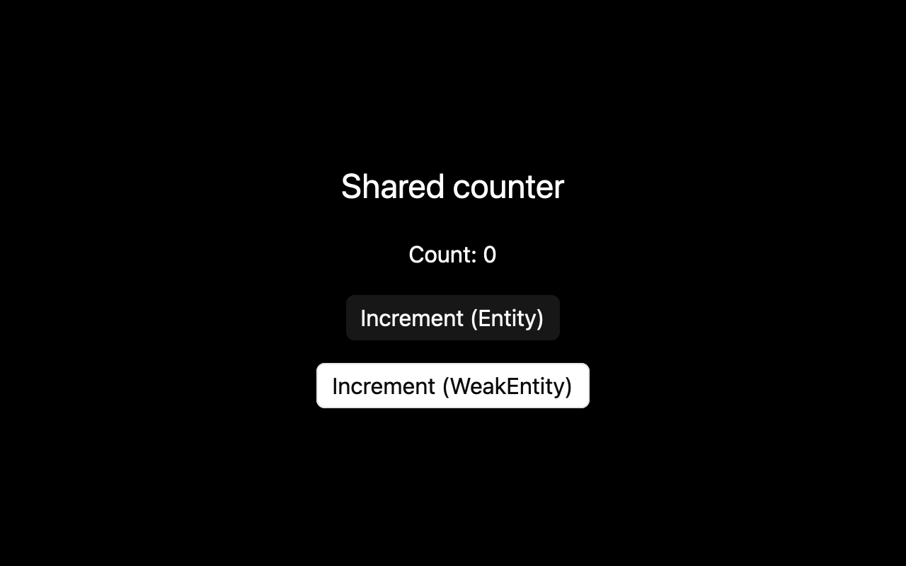

# Entities and weak handles

## What you'll build

Run a window with one shared counter and two buttons. One button captures a strong [entity handle](../appendices/api-inventory.md); the other captures a weak handle and upgrades it before use. From the workspace root, run `cargo run -p mkit-example-state-entities`.



## Concept

An [**`Entity<T>`**](https://github.com/zed-industries/zed/blob/d89e9c2124b2786a390c7a451c7488601b4da2e1/crates/gpui/src/app/entity_map.rs#L414) is a typed, strong handle to state owned by GPUI. Cloning the handle keeps that state alive. A [**`WeakEntity<T>`**](https://github.com/zed-industries/zed/blob/d89e9c2124b2786a390c7a451c7488601b4da2e1/crates/gpui/src/app/entity_map.rs#L740) does not keep it alive; `upgrade()` returns `None` after the last strong handle is gone. A view can share an entity with another view or callback without copying the state itself. The [pinned `gpui-pre` 0.3.5 guide](https://docs.rs/crate/gpui-pre/0.3.5) describes entities as GPUI-owned state.

## Minimal compiling example

The model, application settings, view, and startup code are all compiled in `examples/state_entities`:

```rust
{{#include ../../../examples/state_entities/src/lib.rs:entity_model}}
```

```rust
{{#include ../../../examples/state_entities/src/lib.rs:global_settings}}
```

```rust
{{#include ../../../examples/state_entities/src/lib.rs:state_entities_view}}
```

```rust
{{#include ../../../examples/state_entities/src/main.rs:state_entities_main}}
```

Run `cargo run -p mkit-example-state-entities`. Run `cargo test -p mkit-example-state-entities --lib --locked` for the entity and weak-handle tests. On macOS, `cargo test -p mkit-example-state-entities --test screenshot --locked` compares the initial view against the image above. The committed image is a 1280 × 800 capture at scale 2.0 after GPUI Kit and default `CounterSettings` initialization. The test compiles on Windows and Linux but reports that headless capture is unsupported by this GPUI pin.

## How it works

Startup installs `CounterSettings`, creates one `CounterModel` with [`AppContext::new`](https://github.com/zed-industries/zed/blob/d89e9c2124b2786a390c7a451c7488601b4da2e1/crates/gpui/src/gpui.rs#L172), and gives its strong handle to `CounterWindow`. The window stores that handle. During rendering, [`Entity::read`](https://github.com/zed-industries/zed/blob/d89e9c2124b2786a390c7a451c7488601b4da2e1/crates/gpui/src/app/entity_map.rs#L464) borrows the current count through the app context, then the view builds its label.

The first button captures a cloned strong handle. The second captures `counter.downgrade()` and checks `upgrade()` before changing the model. Both call [`Entity::update`](https://github.com/zed-industries/zed/blob/d89e9c2124b2786a390c7a451c7488601b4da2e1/crates/gpui/src/app/entity_map.rs#L476) with a closure that receives `&mut CounterModel` and its context. The closure calls `cx.notify()` so the count redraws. While this window exists, it holds a strong model handle, so both buttons can increment it. The buttons alone do not demonstrate a released weak handle.

The test `entity_updates_and_global_configuration_are_shared_with_the_view` clicks both buttons with a step of three and uses [`Entity::read_with`](https://github.com/zed-industries/zed/blob/d89e9c2124b2786a390c7a451c7488601b4da2e1/crates/gpui/src/app/entity_map.rs#L470) to check counts of three and six. The separate `weak_handle_does_not_keep_entity_alive` test drops its only strong handle, then checks that `upgrade()` returns `None` and [`WeakEntity::update`](https://github.com/zed-industries/zed/blob/d89e9c2124b2786a390c7a451c7488601b4da2e1/crates/gpui/src/app/entity_map.rs#L777) returns an error.

The screenshot test constructs `CounterWindow::preview()`, which starts without a model because the headless capture creates its GPUI app internally. On first render, `get_or_insert_with` creates the same default model through `cx.new`. This is a screenshot setup path; the runnable app creates its model in `main`.

## Common mistakes

**Assuming a weak handle still has a model.** A callback that uses a released `WeakEntity` has no state to update. Check `upgrade()` or handle the `Result` from weak `update`; keep a strong `Entity` only for as long as the model should live. The [pinned weak-handle implementation](https://github.com/zed-industries/zed/blob/d89e9c2124b2786a390c7a451c7488601b4da2e1/crates/gpui/src/app/entity_map.rs#L766-L789) and the crate's released-handle test support this behavior. No matching official Zed issue or discussion was found for this synchronous case; that report-level evidence remains a review gap.

## Exercises

1. In `CounterWindow::render`, change `let count = counter.read(cx).count` to read the value with `read_with`. Run the library test and the app; the initial label should still show zero and each button should still increment it.
2. Change the default `increment_by` to two. Run the app and confirm either button adds two. Restore one before running the committed screenshot comparison, or update the baseline intentionally on macOS after visual review.

## API reference links

- [Entity](https://github.com/zed-industries/zed/blob/d89e9c2124b2786a390c7a451c7488601b4da2e1/crates/gpui/src/app/entity_map.rs#L414), [WeakEntity](https://github.com/zed-industries/zed/blob/d89e9c2124b2786a390c7a451c7488601b4da2e1/crates/gpui/src/app/entity_map.rs#L740), [AppContext](https://github.com/zed-industries/zed/blob/d89e9c2124b2786a390c7a451c7488601b4da2e1/crates/gpui/src/gpui.rs#L172), [Context](https://github.com/zed-industries/zed/blob/d89e9c2124b2786a390c7a451c7488601b4da2e1/crates/gpui/src/app/context.rs#L21), [Render](https://github.com/zed-industries/zed/blob/d89e9c2124b2786a390c7a451c7488601b4da2e1/crates/gpui/src/element.rs#L163)
