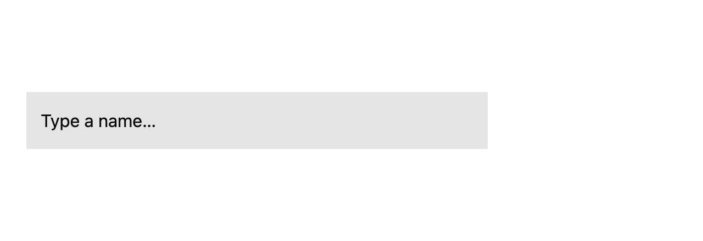
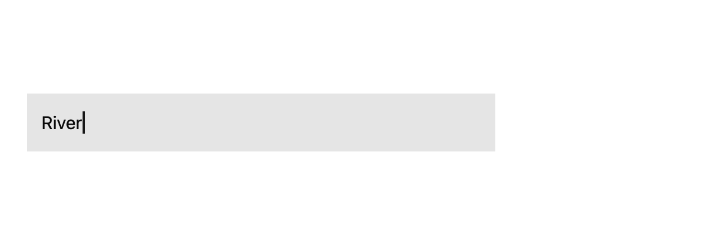
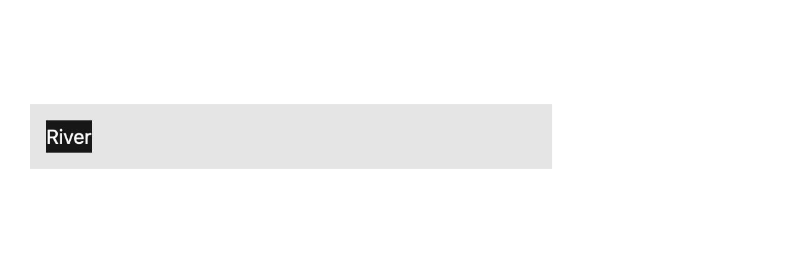
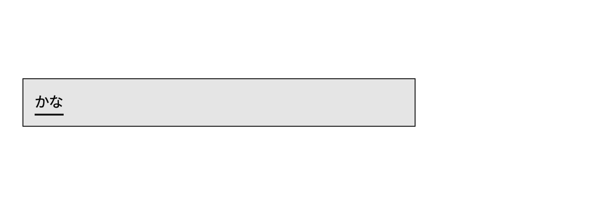

# Build a single-line text field

## What you'll build

A minimal editable field with a visible caret, selection, and composing text. Run `cargo run -p mkit-example-text-input --locked`. The macOS screenshot test captures these four synthetic states at 1280 × 440 pixels, scale 2.









## Concept

A text field combines retained text state, a focus handle, paint-time input-handler registration, key events, selection geometry, and rendering. [`EntityInputHandler`](https://github.com/zed-industries/zed/blob/d89e9c2124b2786a390c7a451c7488601b4da2e1/crates/gpui/src/input.rs#L13-L125) defines the text service; [`ElementInputHandler`](https://github.com/zed-industries/zed/blob/d89e9c2124b2786a390c7a451c7488601b4da2e1/crates/gpui/src/input.rs#L128-L145) connects it to a painted element. The [pinned GPUI input example](https://github.com/zed-industries/zed/blob/d89e9c2124b2786a390c7a451c7488601b4da2e1/crates/gpui/examples/input.rs) illustrates a larger version of this pattern.

## Minimal compiling example

```rust
{{#include ../../../examples/text_input/src/main.rs:text_field_main}}
```

```rust
{{#include ../../../examples/text_input/src/lib.rs:text_field_element}}
```

The other chapters show the [handler](handler-contract.md), [composition methods](ime-composition.md), and [editing methods](selection-and-undo.md). Run `cargo test -p mkit-example-text-input --locked`; `tests/screenshot.rs` compares all four baselines on macOS.

## How it works

The binary initializes GPUI Kit, opens a window and focuses `TextField`. The view retains text, selection, marked range, and text-only undo history. During paint, a `canvas` callback registers its input adapter and bounds. Input callbacks update state, notify, and render the caret, selection, or mark. The library tests type through the synthetic input path and exercise cursor movement, selection, replacement, marked text and undo. The screenshot test uses fixed fixture states. The example does not cover pointer caret placement, grapheme movement, selection extension, native IME candidate UI, or a full accessibility contract.

## Common mistakes

**Assuming a low-level handler covers every field behavior.** [Zed issue #42774](https://github.com/zed-industries/zed/issues/42774) requests a complete GPUI input component with keybindings, mouse interaction, blinking cursor, and cross-platform IME. The report is a later feature request. Treat each behavior as a separate implementation and test obligation; do not claim native IME support from a synthetic harness test.

## Exercises

Type a short ASCII word and a non-BMP character. Use Select All and replace them, then undo. Run the library test and inspect text and UTF-16 selection. Try a native IME and record whether marked text and candidate placement follow the real caret; the automated harness does not prove that behavior.

## API reference links

- [`EntityInputHandler`, `ElementInputHandler`, `Window::handle_input`, `UTF16Selection`, and `FocusHandle`](../appendices/api-inventory.md) · [pinned handler source](https://github.com/zed-industries/zed/blob/d89e9c2124b2786a390c7a451c7488601b4da2e1/crates/gpui/src/input.rs#L13-L145)
