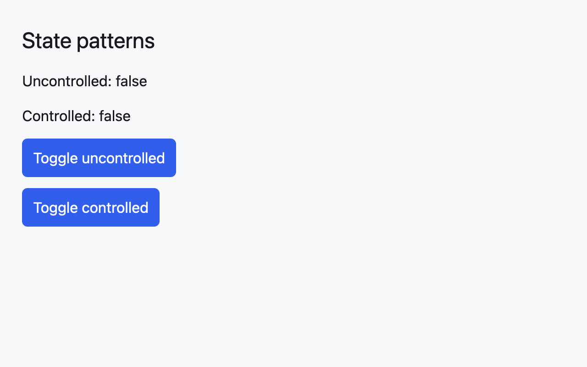
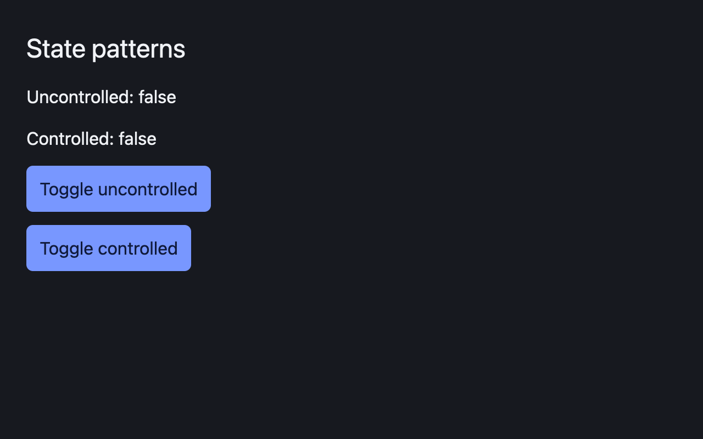
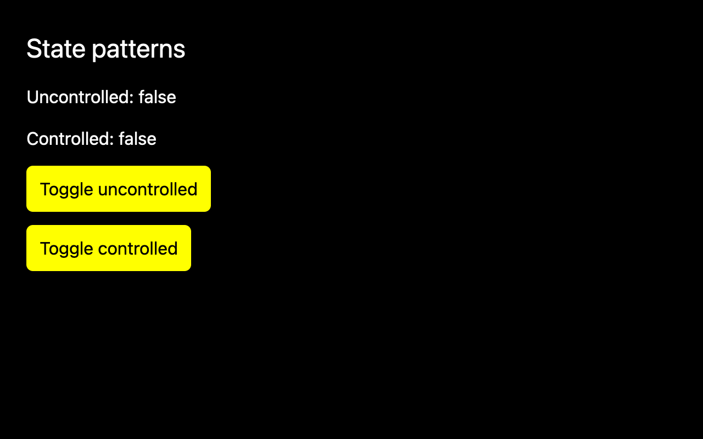

# The mkit design language

mkit ships one default look, not a neutral blank slate. It is dense, dark-first, and quiet, so a pro tool feels calm while the content stays loud. The same semantic tokens also drive a light palette and a high-contrast palette, and components read them at runtime instead of hard-coding colors or sizes.

This is the design-language reference. It documents the principles and the token set in `crates/mkit-core/src/theme.rs`. A redistributable icon set and theme authoring from files are not shipped yet; their gaps are recorded at the end. The component guides in [Everyday component drafts](../components/everyday-components.md) and the everyday and pro-app guides describe how each control consumes these tokens.

## Principles

### Density

Pro tools put a lot of information on screen at once, so mkit defaults to the compact end of each scale rather than the airy end:

| Dimension | Token | Value |
| --- | --- | --- |
| Control height | `controls.xsmall` | 28 logical px |
| | `controls.small` | 32 |
| | `controls.medium` | 36 |
| | `controls.large` | 40 |
| Spacing | `spacing.none` | 0 |
| | `spacing.xsmall` | 4 |
| | `spacing.small` | 8 |
| | `spacing.medium` | 12 |
| | `spacing.large` | 16 |
| | `spacing.xlarge` | 24 |
| | `spacing.xxlarge` | 32 |
| Radius | `radii.none` | 0 |
| | `radii.small` | 4 |
| | `radii.medium` | 8 |
| | `radii.large` | 12 |
| | `radii.pill` | 999 |
| Border width | `borders.hairline` | 1 |
| | `borders.regular` | 1 |
| | `borders.strong` | 2 |

Use `spacing.medium` (12) as the default gap between a label and its control, and `controls.medium` (36) as the default control height. Reach for the next step only when the content asks for it.

### Contrast

Color is described by role, never by hue. A component asks for `colors.border` or `colors.danger`; a theme decides what those are. That is what lets the same component look right in the light, dark, and high-contrast palettes.

| Role | Meaning |
| --- | --- |
| `colors.background` | The window behind everything. |
| `colors.surface` | A panel or card sitting on the background. |
| `colors.elevated_surface` | A surface raised above another surface, such as an open menu. |
| `colors.text` | Primary readable text and icons. |
| `colors.text_muted` | Secondary labels and helper text. |
| `colors.border` | Dividers, control outlines, and separators. |
| `colors.accent` | The primary action, selected state, or active fill. |
| `colors.accent_text` | Text and icons drawn on `accent`. |
| `colors.focus` | Focus rings and keyboard focus cues. |
| `colors.success` | A completed or positive state. |
| `colors.warning` | A caution that is not an error. |
| `colors.danger` | A destructive action or an error. |
| `colors.disabled` | Unavailable controls and their text. |

Focus is a first-class role, not a tint of the accent, so a high-contrast theme can separate the two. Never place text on a surface without checking its pair (`text` on `background`, `accent_text` on `accent`).

### Typography

mkit fixes the type scale and leaves font-family selection to the host application, because a pro tool usually inherits the platform or product font.

| Token | Size | Typical use |
| --- | --- | --- |
| `typography.caption` | 12 | Helper text, metadata, tags. |
| `typography.body` | 14 | Default body and control labels. |
| `typography.body_emphasis` | 14 | Emphasized body text. |
| `typography.heading_small` | 16 | Panel titles and row headings. |
| `typography.heading` | 20 | Section headings. |
| `typography.heading_large` | 28 | Screen titles. |

Keep line length short in dense panes, and prefer `text_muted` over a lighter font weight for secondary text.

### Iconography

Icons are monochrome, stroke-based, and inherit `currentColor` so they match the text role beside them. Size an icon to the control it sits in: the body size in a `controls.medium` control, and one step larger for a standalone toolbar glyph.

An icon is decoration when a visible label already names the action, and meaningful when it is the only label. A meaningful, icon-only control must carry an explicit accessible name; mkit components expose an `aria_label` (or equivalent) for that case and never invent a name from the glyph. mkit does not bundle an icon set yet, so today a caller supplies an `AnyElement` or SVG. The [planned icon set](https://github.com/s4njee/mkit/blob/main/plan.md) will add a licensed set with a consistent grid; until then, match the stroke weight and grid of the icons you supply yourself.

## Built-in themes

| Constant | Name | Use it for |
| --- | --- | --- |
| `LIGHT` | `light` | The standard light palette. |
| `DARK` | `dark` | The standard dark palette and the default direction. |
| `HIGH_CONTRAST` | `high-contrast` | Maximum contrast; wider borders, no shadows, no motion. |
| `SHADCN_LIGHT` | `shadcn-light` | A compact, neutral palette inspired by shadcn/ui. |
| `SHADCN_DARK` | `shadcn-dark` | The dark companion to `SHADCN_LIGHT`. |

`SHADCN_LIGHT` and `SHADCN_DARK` use slightly tighter radii (`radii.medium` is 6 instead of 8). `HIGH_CONTRAST` uses a black background, white text and borders, a yellow accent, a cyan focus color, `borders` of 2/2/3, and zero-duration motion. All five themes share the typography, spacing, control-size, and (except high contrast) shadow and motion scales above.



*Light theme, 1x baseline capture. The demo toggles render from the installed theme global.*



*Dark theme, 1x baseline capture.*



*High-contrast theme, 1x baseline capture. Borders widen and shadows disappear.*

The baselines come from `examples/state_entities/tests/component_state_screenshot.rs`, which compares all three themes at 1x and the light theme at 2x on macOS. The pinned GPUI renderer is unavailable on Linux and Windows, so those targets build and report an explicit unsupported-platform result instead of a pixel comparison.

## Using the tokens

`Theme` is a GPUI `Global`, so an application installs one theme for the whole process and every window that reads the global is scheduled to redraw. Read it from an `App` or view context with `cx.global::<Theme>()`, then pass the semantic fields into the element builder.

```rust
{{#include ../../../examples/state_entities/src/theme_tokens.rs:theme_token_read}}
```

Install a built-in theme with `set_theme(cx, DARK)`, or a named helper such as `set_light_theme(cx)`, `set_dark_theme(cx)`, `set_high_contrast_theme(cx)`, `set_shadcn_light_theme(cx)`, or `set_shadcn_dark_theme(cx)`. Each helper calls `App::set_global` and then `App::refresh_windows`. A headless two-window test in `mkit-core` checks that both windows render again with the replacement theme. Read [Shared configuration with Global](../state/globals.md) for the general global pattern.

### Theme files

A theme can also come from a JSON file. `Theme::from_json` requires every token and reports the first missing or invalid one by its dotted path, such as `colors.focus`, without changing the installed theme. `Theme::to_json` writes the same format, and `Theme::to_css_custom_properties` exports the tokens for a web page. All five built-in themes round-trip through the file format unchanged.

```rust
{{#include ../../../examples/state_entities/src/theme_tokens.rs:theme_file}}
```

## Common mistakes

- **Hard-coding a color.** A literal like `rgb(0x17191f)` matches the dark background today and breaks the light and high-contrast themes. Symptom: one theme looks right and the others do not. Cause: the constant bypasses the role. Correction: read `cx.global::<Theme>().colors.<role>`.
- **Choosing a size that skips a step.** A 14 px gap between `spacing.small` (8) and `spacing.medium` (12) makes two panels drift apart over time. Correction: use the nearest token, or add a token to the theme and justify it.
- **Using the accent as a focus ring.** `colors.accent` is the primary action color; `colors.focus` is the keyboard cue. Correction: use `colors.focus` for focus, so a theme can keep the two distinguishable.

## Limits and open questions

- The icon set and the icon component are not implemented. Components accept caller-supplied icons and require an explicit accessible name.
- Theme files must list every token; a file cannot yet extend a built-in theme. There is no theme editor in the gallery.
- `mkit_core::contrast` measures WCAG contrast for 23 token pairs in every built-in theme. Text and muted text meet 4.5:1 on every surface. Some pairs are below target: borders against surfaces (below 3:1 in the light, dark and shadcn themes), the focus ring against accent-coloured controls, and the high-contrast danger colour (6.68:1 against a 7:1 target). The fixes are pending design review.
- Motion durations are tokens, but callers still decide whether to animate; honoring the OS reduced-motion setting is tracked separately.
