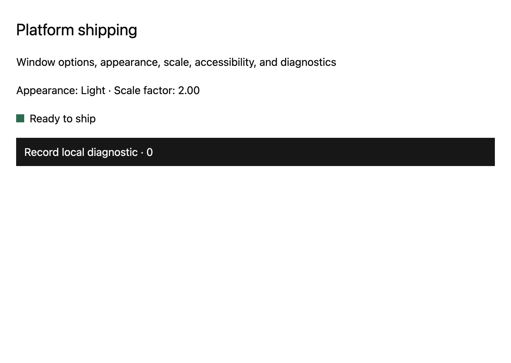

# Windows and appearance

## What you'll build

A two-window app that reports its appearance and display scale. Run `cargo run -p mkit-example-platform-shipping --locked`. The macOS harness image shows the main view in light appearance. Its output is 1520 × 1080 pixels; the view reports a native display scale of 2.0 on the capture host. The screenshot does not show the two native titlebars.



## Concept

`WindowOptions` describes a window before creation. `App::open_window` builds a retained root view and returns a typed window handle. `Window::appearance` reads light or dark appearance, and `Window::scale_factor` reads the display scale. Use that scale when translating pixels to logical GPUI sizes; a screenshot at one scale cannot prove every display configuration. [Pinned options](https://github.com/zed-industries/zed/blob/d89e9c2124b2786a390c7a451c7488601b4da2e1/crates/gpui/src/platform.rs#L2044-L2110) and [window opening](https://github.com/zed-industries/zed/blob/d89e9c2124b2786a390c7a451c7488601b4da2e1/crates/gpui/src/app.rs#L1283-L1324) define the contract.

## Minimal compiling example

```rust
{{#include ../../../examples/platform_shipping/src/lib.rs:window_options}}
```

```rust
{{#include ../../../examples/platform_shipping/src/lib.rs:multiple_windows}}
```

```rust
{{#include ../../../examples/platform_shipping/src/lib.rs:appearance_scale}}
```

Run `cargo test -p mkit-example-platform-shipping --locked`. The library tests check independent roots for two test windows and read an explicitly set scale factor. `tests/screenshot.rs` compares the main view on macOS. Neither test checks native decoration, titlebar, window-close behavior, or an OS appearance change.

## How it works

The primary options set bounds, a system title, minimum size, and a server-side decoration preference. They do not construct a custom titlebar. The binary opens a primary view and a companion diagnostics view. `ShippingDemo` reads `Window::appearance` and `Window::scale_factor` and uses GPUI Kit theme colors. The test opens two windows with independent retained roots, then changes one root and checks the other is unchanged. The [pinned titlebar options](https://github.com/zed-industries/zed/blob/d89e9c2124b2786a390c7a451c7488601b4da2e1/crates/gpui/src/platform.rs#L2245-L2292) and decoration field state that some window-manager requests may be ignored.

For a native check, launch the binary on each target desktop. Confirm that both windows open with the expected titles, can move, resize, focus, and close independently, and respect their minimum sizes. On Linux, check both X11 and Wayland because decoration handling belongs partly to the window manager or compositor. To test a custom titlebar, add one deliberately and check its drag region and window controls on each target; this example does not supply that test. Change the OS between light and dark while the app is open, then move a window between displays with different scale factors. Record the displayed appearance and scale after each change and inspect text, hit targets, and bounds. The current automated test sets a synthetic scale to 1.5 and accepts any supported appearance variant; it does not assert an OS theme transition or display move.

## Common mistakes

An [official Zed report about macOS floating-window focus](https://github.com/zed-industries/zed/issues/54017) shows why native window behavior needs a real desktop test. It concerns `gpui` 0.2.2 and floating windows, not this normal-window fixture or the pinned `gpui-pre` 0.3.5. For this example, check titlebars and decoration on each target; the [pinned options](https://github.com/zed-industries/zed/blob/d89e9c2124b2786a390c7a451c7488601b4da2e1/crates/gpui/src/platform.rs#L2087-L2107) say a window manager may ignore decoration requests.

## Exercises

Change one window's bounds and titlebar option. Check the two-window test, then inspect both windows on a real desktop. Record results for native decorations, appearance changes, and a display-scale change before claiming those behaviors are supported.

## API reference links

- [`WindowOptions`, `TitlebarOptions`, `WindowBounds`, `App::open_window`, `Window::appearance`, `Window::scale_factor`](../appendices/api-inventory.md) · [pinned platform source](https://github.com/zed-industries/zed/blob/d89e9c2124b2786a390c7a451c7488601b4da2e1/crates/gpui/src/platform.rs#L2044-L2293)
